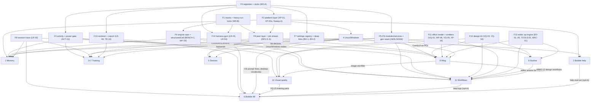

# Bobble push — the cross-track build plan

Planner doc for the 2026-09-23 push, written 2026-09-23. **Plan only.** No repo file was changed except
creating this one, and nothing was installed or run beyond read-only checks (`git log/status/worktree
list`, `pmset -g batt`, `df`, `which`, `wc`, `grep`).

**Inputs.** The ten research docs beside this file: `hindsight-memory.md` (track 1), `bobble-help.md`
(2), `training.md` (3 + 7), `crossplatform.md` (4), `devices-tailscale.md` (5), `harness-lora.md` (6),
`studios-editors.md` (8), `ming-models.md` (9), `visual-quality.md` (10), `workflows.md` (11). Also the
memory notes they cite, and the current code.

**Base commit: `c1f7d578`** (main, 2026-09-23 17:31, "Vision on unless switched off, delete that stops
everything, cards with no edge, and the computer-use fixes…"). That is the in-flight wave the user asked to
finish first. The research docs were written against `c9fe7098`, one commit earlier; nothing in this plan
depends on the difference.
**One stray change is still uncommitted:** `apps/desktop/electron/gen/hyperframes-window.ts` (+15/−2,
another agent's). VQ-05 builds on that file, so it is committed (or explicitly handed to the VQ lane)
before Wave 0 starts.

**ID key.**
- Package ids are the research docs' own, with three renames to remove collisions: harness-lora's
  `WP-01…21` become **`LR-01…21`**, workflows' `WP-00…15` become **`WF-00…15`**, and studios' `XP-01`
  (ComfyUI baseline graphs) becomes **`SX-01`**. Memory keeps `WP-M0…M12`.
- Packages this plan splits get a suffix: `XP-02a/b`, `XP-06a/b`, `XP-11a/b`, `XP-20a`, `WP-M3a/b`,
  `VQ-11L` (lite), `LR-20a`.
- Packages this plan adds: `W0-A`, `W0-B`, `ACT-01`, `GEN-SEAM`, `BENCH-1`, `MING-S0`, `WF-00b`, and the
  optional `SEC-01`.
- Sizes follow the training/crossplatform/workflows docs: **S** ≤ 1 agent-day · **M** 2–4 days ·
  **L** 1–2 weeks · **XL** > 2 weeks.

---

## 0. The plan on one screen

- **Shape.**
  - **12 lanes**, one git worktree each (two for `PLAT`, `VQ` and later `EDIT`). There are ten track
    lanes; tracks 3 and 7 share `TRAIN`.
  - **INT** is the integrator. It owns the shared registries, every `package.json` and `pnpm-lock.yaml`,
    packaging, and the merge queue.
  - **BENCH** is an operator role, not a code lane. It is the only thing allowed to start a model
    server, a GPU job, a training run, or a download over 200 MB. It runs one job at a time, on AC power,
    only while the user's own Bobble is idle (§4).
- **Waves.**
  - **W0 pre-wire**: 2 packages. The only serial step, about 2–3 agent-days.
  - **W1**: foundations, quick wins and measurements (47 packages; 16 of them can start alongside W0).
  - **W2**: core services.
  - **Sweep A**: the platform call-site sweep, serial, 1–2 days.
  - **W3**: UI surfaces and the first vertical slices.
  - **W4**: integration and ship-level features.
  - **W5**: long poles gated on hardware, accounts or upstream projects.
  - W1–W4 are estimated at 1–2 weeks of wall time each with every lane busy; W5 is open-ended
    (estimates, not measurements).
- **Finding 1: the tracks share their foundations.** Twelve pieces were designed independently in two
  to five docs each. §1 builds each one once, first:
  - a "someone is using the model right now" signal (memory's LLM gate, the workflows yield rule,
    pictures inside documents, help's waiting line, training's chat parking);
  - structured output plus per-engine capability checks (workflows, Ming's layout enhancer, memory
    extraction);
  - a mock OpenAI/llama-server (help, workflows, devices, training);
  - one runtime-module and long-lived-service manager (Hindsight, training, export, editing tools, Ming,
    gen);
  - one gen-queue seam (studio edits, Ming, the improve loop, remote gen, VRAM admission);
  - one Qwen3.5 renderer and one export pipeline (the training dashboard's export *is* Bobble 4B's
    export);
  - one session-trace reader (the LoRA analyzer, dataset-from-chats, memory backfill, save-as-workflow);
  - one peer job stream (remote gen = remote training = remote Ming);
  - one design kit (decks, charts, motion, pages, studio presets, Ming presets);
  - one office render-from-spec (research deliverables, decks, Ming layers → editable pptx);
  - one editor op engine (studios, chat `edit_image`, Ming layers, the improve UI);
  - one settings registry with deep links.
- **Finding 2: about twenty existing files are wanted by three to seven tracks each.** Examples:
  - `electron/ipc-contract.ts` 7 tracks, `settings-contract.ts` 7;
  - harness `presets/capabilities.ts` 6, `gen/gen-manager.ts` 6, `packages/ui/.../glyph.tsx` 6;
  - `settings/SettingsView.tsx` 5, `tools/office-gen/*` 4;
  - `inference/supervisor-entry.ts` 3 tracks but 7 packages, gen-service `catalog.ts` 3,
    `chat/ChatComposer.tsx` 3.

  W0 turns most of them into registries that each feature extends from its own new files. The rest get
  one owner per wave (§2.10).
- **Finding 3: the Mac, not the agents, is the throughput limit.**
  - Every track has at least one job that needs the GPU, a model server or a large download.
  - On 24 GB these jobs must run one at a time.
  - The BENCH queue (§4) holds about 31 GB of core downloads and roughly 50–60 hours of heavy runs
    across W1–W4, about a third of it overnight scorecard runs (estimates).
- **Finding 4: seven of the user's answers gate about 40% of the packages.** They are questions 1–7 in §5:
  - approval to run heavy jobs;
  - the roadmap reorder for fine-tuning;
  - one licence policy for defaults;
  - GPU compute;
  - test hardware;
  - an HF write token;
  - the workflows stance.

  Every other question has a recommended default, so work proceeds without waiting.
- **What the user sees at the end of each wave.** Every item is checked headlessly, with before/after
  screenshots that were looked at.
  - **W1**:
    - office and chart renderer bugs fixed;
    - HyperFrames stops printing the prompt as the title;
    - the guardian is safe off macOS;
    - the Mage-Flow download is fixed;
    - measured numbers for memory, training, editing, Ming and engine capabilities.
  - **W2**:
    - Ming design images from any chat;
    - the `diagram` tool;
    - the device relay and the supervisor's remote model slot working against a fake node (the real
      two-instance run is W4);
    - memory learning behind its gate (no UI yet);
    - the design kit;
    - the workflow engine (no UI yet).
  - **W3**:
    - memory in chats, plus the Memory tab;
    - Bobble help with live settings cards;
    - the Training view;
    - the Devices panel and "Add a server by address";
    - click-to-comment region edits;
    - designed decks;
    - Deep research from the + menu.
  - **W4**:
    - the Image editor replaces the Image Studio;
    - GGUF/MLX exports land in the model library;
    - "Serve from" in the engine menu;
    - the Workflows page;
    - the Design panel;
    - Ming layers;
    - Windows/Linux builds from CI.

---

## 1. Dependency graph across tracks

### 1.1 Shared foundations: build once, first

| # | Foundation | Built by (wave) | Consumed by |
|---|---|---|---|
| **F0** | **Pre-wired registries.** Covers: feature contract stubs composed into `ipc-contract.ts`; `register*` stubs in `main.ts`; per-feature settings groups; settings-section, route, sidebar, + menu, thread-slot, thread ⋯ menu, top-bar notice and storage-row registries; env-contributor and scoped-pi-bridge seams in `pi/pi-main.ts`; `electron/lifecycle.ts` (quit reaping, orphan signatures); the activity API skeleton; capabilities split into one file per capability; the glyph batch; new workspace package skeletons; one lockfile change | W0-A (W0) | every lane |
| **F1** | **Test doubles and heavy-run control.** `_mock-openai.mjs` (OpenAI plus the llama-server surface: SSE tool calls, `reasoning_content`, `/completion`, `/props`, `/slots`, `/health`, cancel-on-disconnect, a request log), `_mock-web.mjs` (DuckDuckGo html/lite, articles, PDFs, the challenge page), `_fake-tailscale.mjs` plus fixtures, `fixtures/fake-hindsight.mjs`, heavy/probe/build locks with AC, orphan and "the user's app busy" checks, `scripts/worktree-new.sh`, `scripts/bench-run.sh` | W0-B (W0) | help BH-6/7/8/10; workflows WF-02/04/07; devices DEV-4/7/8/9/10; training TR-12; memory WP-M4/M7; LoRA LR-03; BENCH |
| **F2** | **Platform layer.** `packages/platform`: pipe/socket endpoints, `spawnTracked` with `windowsHide`, process list/tree/kill/suspend, venv/exe paths, zip/tar, junctions, support dirs, bash for pi. Plus the guardian off-mac fix | XP-01, XP-02a (W1); XP-02b (Sweep A) | every new bridge or process (help bridge, memory service, cluster-node, training worker, tools worker, harness-gym host), all of track 4, TR-14, DEV-13 |
| **F3** | **Activity and background power gate.** `electron/activity/chat-activity.ts` turns chat turns, subagents, corp, scheduled runs, composer primes and gen jobs into busy/idle, quiet windows and preempt events. `power-gate.ts` applies the AC / battery % / thermal policy | ACT-01 (W1) | memory LLM gate (WP-M4); workflows yield (WF-02); pictures in documents (VQ-09); help's waiting line (BH-7); training AC-only and chat parking (TR-4); scheduled workflows (WF-13) |
| **F4** | **Engine capabilities and structured output.** The BENCH-1 table (json_schema per engine, cancel-on-disconnect, `/completion` with images and `n_probs`, image re-encode cost), plus `structuredCall` and `engine-caps.ts` | BENCH-1, WF-03 (W1) | every bounded workflow step; Ming's design-layout enhancer (MING-6); memory's gate shaping (WP-M4); office planners (VQ-08); the improve-loop judge (WF-08) |
| **F5** | **Runtime modules and service supervisor.** One module spec registry (`electron/modules/`: uv env, weights, marker, ModuleCard progress) and one long-lived-process supervisor (health, backoff, quit reaping, orphan adoption, `guardRun`) | GEN-SEAM (W1) | memory runtime (WP-M2/M3b); training and export modules (TR-3); editing tools (TOOLS-01); Ming design module (MING-2); today's gen modules; ComfyUI per OS (XP-17) |
| **F6** | **Gen queue seam.** A public `GenQueueControl` (`generateImage`, `editImage`, `run3d`), a job-builder registry, and admission, note-sink, activity and device-routing hooks | GEN-SEAM (W1) | studio ops (ED-04, IMG-04); Ming dispatch (MING-3); improve loop (WF-08); pictures in documents (VQ-09); remote gen (DEV-12); VRAM admission (XP-15) |
| **F7** | **Settings registry and deep links.** `app-nav-store` plus the `bobble:` allow-list (W0-A), the typed registry split per section (BH-1), row focus and highlight (BH-2) | W0-A, BH-1 (W1), BH-2 (W2) | help; every new section (memory, devices, design, workflows, training); links such as "Manage memory", "Manage devices", "Train on this", "Open workflow" |
| **F8** | **Session trace reader.** `packages/engine/src/session/trace.ts`: the turn tree, tool calls, custom entries and harness-nudge markers | LR-02 (W1) | LoRA analyzer (LR-02/19); dataset from chats (TR-9); memory outbox shaping and backfill (WP-M5/M12); save-as-workflow (WF-12) |
| **F9** | **Peer layer and generic job stream.** Tailscale adapter, device store/pairing/tokens, the cluster-node gateway and relay, the supervisor's `remote` slot, and **one resumable NDJSON job route** on the gateway | DEV-0…DEV-6 (W1–W2) | Devices serving; remote gen (DEV-12); remote and multi-device training (TR-15/16); remote Ming (MING-11); hardware CI lanes over Tailscale (XP-26); an optional remote memory learner |
| **F10** | **Design kit.** Validated palettes (VQ-03) plus kits and brands as token data (VQ-04) | W1–W2 | charts; decks and one-pagers (VQ-06); motion (VQ-11); pages (VQ-12); studio presets (IMG-10/11); Ming presets (MING-7); workflow documents (WF-06/07); Design settings (VQ-14) |
| **F11** | **Office render-from-spec and native emitters.** Renderer correctness (VQ-01), `office.py render --spec` with citations, sources and multi-sheet (WF-06), HTML → native emitters with `PresentBridge.measure` (VQ-05), bundled fonts (XP-16). One lane (VQ-office) owns `tools/office-gen` | W1–W2 | deck composer (VQ-06); research deliverables (WF-07); Ming layers → editable pptx (MING-9); Windows/Linux text fit |
| **F12** | **Editor op engine.** Documents (ED-01), version tree (ED-03), op router and editor-manager (ED-04), stitcher (ED-05), the editing-tools worker (TOOLS-01), the Apple Vision helper (MAC-01) | W1–W2 | the three studios; chat `edit_image` (CHAT-01); Ming edit and layers (MING-9); the improve UI (WF-09) |
| **F13** | **Qwen3.5 renderer and export pipeline.** One renderer with span masks on the app's patched template (LR-08, used by TR-2). One export path: merge into the HF originals → pinned `convert_hf_to_gguf` → shipped `llama-quantize` + imatrix → MLX + MTP sidecar → library registration (TR-10, used by LR-14) | W1 and W4 | training; Bobble 4B; dataset tooling |
| **F14** | **harness-gym.** Headless pi with the app's real extensions and a plain-Node bridge host | LR-03/04 (W1–W2) | Bobble 4B data and evals; optional later reuse for help and workflow evals |

### 1.2 Graph

### 1.3 One implementation, not N: the cross-track merges this plan makes

1. **Activity signal.**
   - Memory's `activity.ts` (WP-M4) and workflows' `chat-activity.ts` (WF-02) are the same thing: **ACT-01**.
   - Training's `power-gate.ts` (TR-4) and memory's battery policy join it.
   - VQ-09 and BH-7 read it.
2. **Structured output.**
   - Workflows' `structuredCall` (WF-03) lives in `packages/harness/src/model-call/structured-call.ts` so
     that Ming's enhancer (MING-6) and memory's gate can use it too.
   - One engine-capability table (BENCH-1) answers memory's, Ming's and workflows' open questions about
     MLX json_schema, cancel-on-disconnect and `n_probs`.
3. **Mock model server.** Help's `_mock-openai.mjs`, workflows' `_mock-model-server.mjs`, training's mock
   lanes and devices' fake llama-server become one file (W0-B).
4. **Modules.** Memory's `memory-install.ts`, training's `train-module.ts`, the tools module and Ming's
   `design` module all register a spec with **one** module registry (GEN-SEAM) and reuse `ModuleCard`.
5. **Gen queue.**
   - Studios' "export the queue, admission and note-sink hooks" (ED-04), workflows'
     `GenQueueControl.generateImage/editImage` (WF-08), Ming's `handleGenerate` branch (MING-3), DEV-12's
     routing and XP-15's VRAM admission all use **one** seam (GEN-SEAM).
   - After GEN-SEAM, nobody edits `gen-manager.ts` again; each feature adds builders in
     `electron/gen/builders/<name>.ts`.
6. **Renderer and export.**
   - LoRA's renderer (LR-08) and training's per-span masks (TR-2) are one module, shipped in the app at
     `packages/training/python/bobble_train/render.py`.
   - LoRA's export (LR-14) *calls* training's export (TR-10) instead of re-implementing merge,
     MTP re-attach, convert, quantize and the MLX sidecar.
   - Training's DPO/GRPO (TR-17) and LoRA stages C/D (LR-19/21) share one backend.
7. **Session trace.**
   - LoRA's analyzer (LR-02), dataset from chats (TR-9), memory's harness-nudge exclusion and backfill
     (WP-M5/M12) and save-as-workflow (WF-12) share `packages/engine/src/session/trace.ts`.
   - That includes one `isHarnessNudge()`.
8. **Peer protocol.** DEV-4's gateway exposes a generic resumable NDJSON job route, which DEV-12 (gen jobs)
   and TR-15 (training jobs) both mount. Ming's vLLM-Omni remote (MING-11) is a catalog variant on the same
   transport.
9. **Design kit.** Studio presets (UI screen, mockups; IMG-10/11), Ming presets (MING-7) and workflow
   documents (WF-06/07) read VQ-04's kits, not their own styles.
10. **Office lane.** WF-06 (render-from-spec, citations, sources, multi-sheet) is built **by the VQ-office
    lane**, in sequence with VQ-01/05/06/08, because all of them edit `tools/office-gen/{office,
    render_deck,doc_render,sheet_render}.py`. XP-16 (fonts) joins that lane too.
11. **Editor ops.** Ming's layer split (MING-9) is an editor op feeding EDIT's Layers panel (IMG-09), not a
    second `LayersPanel`. Ming's design presets are **data** in the editor's preset registry (IMG-10), not
    edits to the old `ImageStudio.tsx`. WF-09's "Improve ×N" plugs into the editor's action registry.
12. **Engine menu.** XP-11's running-line flavour and device, and DEV-8's "Serve from" section, are one
    engine-menu package (DEV-8, W4). XP-11a supplies `llm:devices` so the chooser lists local GPUs next to
    remote devices.
13. **Fonts.** XP-16 (office text fit on PCs), VQ-05 (embedded PDF fonts) and VQ-12 (page kit) use one
    bundled OFL font set under `resources/fonts/`.
14. **Guide pages and settings.**
    - Every lane that adds a Settings section or sidebar destination ships its own guide page
      (`resources/help/guide/<id>.md`) and its own registry file (`electron/help/registry/<section>.ts`).
    - BH-1's compile-time coverage and BH-3's drift tests enforce this, so help never lags the features.

### 1.4 Decision and hardware gates

| Gate (question # in §5) | Blocks | First wave hit |
|---|---|---|
| Q1 heavy-run go-ahead + downloads | BENCH-1, WP-M0, TR-0, SPK-01, MING-S0/4/5, LR-08 parity, every real TTFT check → the defaults of memory, training, studios, Ming, workflows | W1 |
| Q2 roadmap reorder (fine-tuning now) | TRAIN lane (all), LORA lane (all) | W1 |
| Q3 licence policy for defaults | IMG-04 catalog visibility, VQ-09 picture defaults, MING-3/7 routing, WF-08 preset | W2–W3 |
| Q4 GPU compute (rent or own) | LR-10…LR-21; the value of TR-14/15 | W3 |
| Q5 test hardware, CI budget, local tooling (OrbStack/Colima, rustup targets, Go) | XP-21/22/24/25/26, TR-14, DEV-13/14, MING-10, SX-01 on PCs | W3–W5 |
| Q6 HF write token | LR-17, the Ming recipe publish (MING-5b), TR-11 HF push | W4–W5 |
| Q8 workflows stance | the WF design basis (WF-01 onwards) | W1 (can start on the recommendation) |
| Q9 `mac` → `desktop` vocabulary | XP-20a (Sweep A), LR-07/11 data generation | Sweep A |
| Hand-started llama-server on linux-ms-7e59 (the user's action) | DEV-16, and DEV-10's live check | W4 |
| Azure Artifact Signing account | XP-19 | W5 |
| A separate macOS user for computer-use data (the user's action) | LR-12 | W3 |

### 1.5 Critical path per track

| Track | Chain (wave) | First user-visible milestone | Gated by |
|---|---|---|---|
| 1 Memory | WP-M1, ACT-01, WP-M3a (W1) · [WP-M0 BENCH] → WP-M2, M3b, M4, M5 (W2) → WP-M6, M7 (W3) → M8, M9, [M10] (W4) → M11, M12 (W5) | W3: a fact told in one chat is recalled in a new one; Memory tab | Q1, Q10, Q11 |
| 2 Bobble help | BH-1, BH-3, BH-4, BH-5 (W1) → BH-6, BH-2 (W2) → BH-7, BH-8, BH-9, BH-10 (W3) → [BH-11], BH-12, BH-14 (W4) → BH-13 (W5) | W3: + › Bobble help changes and shows settings inline | Q12 |
| 3+7 Training | TR-1, TR-2 · [TR-0] (W1) → TR-3, TR-4, TR-8 (W2) → TR-5, TR-6, TR-7, TR-9 (W3) → TR-10, TR-11, TR-12, [TR-13] (W4) → TR-14…TR-18 (W5) | W3: dashboard (fake worker); W4: real 0.8B run exported to the library and used in chat | Q1, Q2, Q19; hardware (TR-14); Devices (TR-15/16) |
| 4 Linux/Windows | XP-01, 02a, 03, 04, 06a, 07, 10 (W1) → XP-05, 06b, 14 (W2) → XP-02b (Sweep A) → XP-08, 09, 11a, 12, 13, 15 (W3) → XP-11b, 17, 18, 20, 23 (W4) → XP-19, 21, 22, 24, 25, 26 (W5) | W3–W4: chat + calibration on CI Linux/Windows runners (CPU/Vulkan), installers built | Q5, Q9, Q25, Q26 |
| 5 Devices | DEV-0…3 (W1) → DEV-4, 5, 6 (W2) → DEV-7, 10, 15 (W3) → DEV-8, [DEV-9], DEV-12, DEV-16 (W4) → DEV-11, 13, 14 (W5) | W3: Devices panel + "Add a server by address"; W4: "Serve from" | Q13, Q27, the user's Linux box |
| 6 Bobble 4B | LR-02, 03, 06, 08 (W1) → LR-04, 05, 07, 09 (W2) → LR-10, LR-12, LR-20a (W3) → vocabulary freeze → LR-11, 13, 14, 15, [16] (W4) → LR-17…LR-21 (W5) | W2: baseline scorecard of the stock 4B; W4–W5: candidate model | Q2, Q4, Q6, Q7, Q9, Q20 |
| 8 Studios | GEN-SEAM, SPK-02, ED-01, ED-03, ED-05, MAC-01 · [SPK-01] (W1) → ED-02, ED-04, TOOLS-01, IMG-01 (W2) → IMG-02…06, AUD-01, VID-01 (W3) → IMG-07…10, IMG-12, AUD-02…04, VID-02 (W4) → IMG-11, SX-01, AUD-05/06, VID-03/04, CHAT-01, PORT-01 (W5) | W3: click-to-comment region edit; W4: the Image editor ships | Q3, Q17 |
| 9 Ming | MING-0, 1 · [MING-S0] (W1) → MING-2, 3, 6 · [MING-4] (W2) → MING-8 · [MING-5] (W3) → MING-7, 9 (W4) → MING-10…13 (W5) | W2: Ming design images from chat | Q1, Q3, Q6, Q18 |
| 10 Visual quality | VQ-00, 01, 02, 03, 08, 11L (W1) → VQ-04, 05, 10, XP-16, WF-06 (W2) → VQ-06, 07, 11 (W3) → VQ-09, 12, 13, 14, 15 (W4) | W1: renderer bugs fixed; W2: `diagram`; W3: designed decks | Q15, Q16, Q28 |
| 11 Workflows | WF-01, 03, 05, 00b · [BENCH-1] (W1) → WF-02, 04 (+WF-06 in VQ) (W2) → WF-07, 08, 10 (W3) → WF-09, 11, 12, 13, 15 · [WF-14] (W4) | W3: + › Research → a cited .docx | Q8, Q14, Q21, Q22 |

`[x]` = a BENCH job (heavy, serialized, AC only).

---

## 2. Waves, lanes and file ownership

### 2.1 Lanes (one worktree each)

Worktrees go under `.claude/worktrees/<lane>`, the existing convention, on branch `push/<lane>`. Seven
older agent worktrees are already there (at `4ae1105e` ×2, `9e8a162c`, `dab8a697`, `04908366`,
`32aec053`, `1aa0c8a3`), plus one scratch worktree at `c9fe7098`. Prune them only with the user's OK.

| Lane | Tracks | Owns across the push | Worktrees at peak |
|---|---|---|---|
| **INT** | — | the registries created in W0; every `package.json` and `pnpm-lock.yaml`; `electron-builder.yml`; `vite.config.ts`; `global.css` tokens; `packaged-probe.mjs`; the merge queue; `/Applications` refresh at wave ends | 1 |
| **BENCH** | — | the heavy queue (§4); results tables. Runs inside the authoring lane's worktree while holding the global heavy lock | operator |
| **MEM** | 1 | `electron/memory/*`, `electron/activity/*`, `packages/memory` | 1 |
| **HELP** | 2 | `electron/help/*`, `packages/help-tools`, `resources/help/*`, `src/chat/help/*` | 1 |
| **TRAIN** | 3 + 7 | `packages/training` (except `render.py`), `electron/training/*`, `src/training/*` | 1 |
| **PLAT** | 4 | `packages/platform`; detection and flavours in `packages/inference`; CI; per-OS packaging; computer-use helpers | 2 (`plat-a` inference/detection, `plat-b` platform/shell/chrome/guardian) |
| **DEV** | 5 | `packages/cluster`, `electron/devices/*` | 1 |
| **LORA** | 6 | `packages/harness-gym`, `tools/harness-lora`, `packages/training/python/bobble_train/render.py` | 1 |
| **EDIT** | 8 | `electron/editor/*`, `src/editor/*`, the gen seam (W1) | 2 from W3 (`edit`, `edit-av`) |
| **MING** | 9 | `packages/gen-service/python/mlx-vlm-ming/*`, `ming_generate.py`, the Ming catalog entry and builder | 1 |
| **VQ** | 10 | `tools/office-gen/*`, `tools/visual-eval`, `packages/charts`, `design-kit`, `visual-lint`, `visual-compose` | 2 (`vq-office`, `vq-kit`) |
| **WF** | 11 | `packages/workflows`, `electron/workflows/*`, `src/workflows/*` | 1 |

That makes about 14 worktrees at peak. pnpm hardlinks from its store, so the disk cost is small. Each
worktree needs a plain `pnpm install` (never `-w`) and its own `npm run build` before probes (memory
`pi-desktop-worktrees-and-build`).

### 2.2 Rules that keep parallel worktrees conflict-free

- **R1. Registries, not edits.** W0-A creates every shared registry listed in F0. A lane extends a registry
  only from its **own new file**. It never touches the registry's list file (that is INT's).
- **R2. One owner per hot file per wave.** §2.10 is the calendar. A lane that needs a hot file outside its
  slot files a one-line request with INT, which lands it first, or waits a wave.
- **R3. New code in new files.**
  - Feature CSS lives in a feature file imported by its component (precedents: `src/tripo/tripo.css`,
    `src/candidates/*/candidates.css`).
  - `src/styles/global.css` (8,835 lines) changes only for tokens (INT) and, in W3, the Windows/Linux top
    bar (PLAT-b).
- **R4. Lockfile.**
  - Never hand-merge `pnpm-lock.yaml`. Take main's copy, run plain `pnpm install`, commit.
  - Every new workspace package already exists from W0, so later changes are dependency bumps, batched
    through INT.
- **R5. Barrels.** W0-A pre-adds export lines, with placeholder files, for planned modules in any package
  that two lanes write to: gen-service (`stitch.ts`, `design-job.ts`) and gen builders. Otherwise the
  owning lane adds its own export. Append-only barrel conflicts are resolved by keeping both lines.
- **R6. Settings.**
  - New keys go only in `electron/settings/features/<feature>-settings.ts` (created in W0).
  - Every key needs an entry in `electron/help/registry/<section>.ts`: BH-1's `satisfies Record<keyof
    DesktopSettings, …>` coverage is a compile error otherwise.
  - A key stays `internal` until its UI ships.
  - Side effects subscribe through `subscribeSettings(prefix, fn)` (W0), never through a new callback in
    `settings-main.ts`.
- **R7. Guide pages.** A package that adds a Settings section or sidebar destination ships
  `resources/help/guide/<id>.md`. BH-3's drift test fails otherwise.
- **R8. Prompt bytes.**
  - Any change to the model-facing prompt or tool surface runs `prompt-diff.mjs` and the prefix-size test
    in its lane (mock model), and files a real TTFT/prefill check with BENCH, batched per wave (memory
    `user-always-check-prefill`).
  - **The CLI vocabulary freezes at the end of W3** for Bobble 4B's training data. Later CLI changes go on
    the LR-20 drift ledger.
- **R9. Portability from W2 on.** New processes and bridges use `packages/platform` (`localEndpoint`,
  `spawnTracked`, `venvPython`, `killTree`). Sweep A migrates the old ~40 call sites, and a grep test
  keeps it that way.
- **R10. Lifecycle.** New long-lived processes register with `electron/lifecycle.ts` (quit reaping and an
  orphan signature for `reap-orphans.ts`) and with `guardRun`, using the new pausable kinds `'service'` and
  `'train'` added in W0.
- **R11. Tests.**
  - Use the package's own vitest (`cd <pkg> && ./node_modules/.bin/vitest run`) and **read the error
    count**.
  - Probes only through `launchApp` (hidden, throwaway HOME, focus guard).
  - `SHOT_DIR` and stable probe homes carry `PD_WORKTREE_TAG`.
  - Never `npm run build` while that worktree's probes are running.
- **R12. Visual changes** carry before/after screenshots in both themes, looked at and attached to the
  merge (memory `user-visual-confirmation-required`).
- **R13. Heavy work only through BENCH.** No lane starts a model server, a GPU or training job, or a
  download over 200 MB itself.
- **R14. Probes never write the shared `~/.pi/desktop/settings.json`** (memory `pi-desktop-guardian`).
- **R15. Commit per package at its gate** (tests, probes, screenshots). INT merges one package at a time
  (§2.11).
- **R16. CI runs need the user (orchestrator note, 2026-09-23).** Running GitHub Actions means pushing to the
  public repo `Lavanukee/Pi-Desktop`, which needs the user's explicit approval — nobody pushes. A package whose
  acceptance says "CI" is judged on: the workflow passing `actionlint`, every job's OS-neutral commands run
  locally, and the unit tests with simulated hosts. The CI run itself is recorded as **DEFERRED (needs
  the user's push)** in the report — verifiers treat it as deferred, not as a failure.
- **R17. One extractor (orchestrator note).** XP-04 ships a self-contained zip extractor at
  `packages/web-tools/src/unzip.ts` (built so `packages/platform` can lift it). XP-02a's `archive.ts` MUST
  lift that file (move it into `packages/platform`, re-export from web-tools) rather than write a second
  implementation (§1.3).

### 2.3 Wave 0 — pre-wire (the only serial step)

**Preconditions**
- The stray `hyperframes-window.ts` change is committed or handed over.
- the user's answers to Q1–Q8 are requested; W0 does not wait for them.

**W0-A · Pre-wire scaffold · M · lane INT**

Existing files touched (merged before any W1 package that depends on them forks):

- **`electron/ipc-contract.ts`**: compose six new feature contracts into `AppInvokeMap`,
  `APP_INVOKE_CHANNELS` and `AppEventMap`. Their stubs are new files: `memory/memory-contract.ts`,
  `help/help-contract.ts`, `training/training-contract.ts`, `devices/devices-contract.ts`,
  `editor/editor-contract.ts` and `workflows/workflows-contract.ts`, each exporting
  `*_INVOKE_CHANNELS = [] as const` plus empty maps.
- **`electron/main.ts`**: six no-op `register*Ipc` calls, from new `*-main.ts` stubs, and a call into
  `lifecycle.ts` from `reapChildProcesses`.
- **`electron/settings/settings-contract.ts`, `settings-logic.ts`, `settings-main.ts`**:
  - compose per-feature groups from new files
    `electron/settings/features/{memory,training,devices,design,workflows,editor}-settings.ts`, each with a
    type, a `DEFAULT` (all off), `clamp` and `merge`;
  - add `capabilities.training`;
  - add a generic `subscribeSettings(prefix, fn)`.
- **`src/settings/SettingsView.tsx`**: `NAV`, `TITLES` and `SectionBody` become a section registry
  (`src/settings/sections/index.tsx` plus one file per section). Hidden stubs are added for `memory`,
  `devices` and `design`.
- **`src/App.tsx`**: a route registry (`src/routes.ts`) with hidden `training` and `workflows` routes, plus
  the `app-nav-store` subscription. New `src/state/app-nav-store.ts` and `src/state/bobble-link.ts` (the
  pure allow-list parser from BH-2).
- **`src/chat/SessionSidebar.tsx`**: a `workspaceNav` registry (`src/chat/workspace-nav.ts`).
- **`packages/ui/src/components/add-menu.tsx`** and **`src/chat/ChatComposer.tsx`**:
  - a + menu entries registry (`src/chat/composer-entries.ts`) with hidden rows for Bobble help, Research,
    Workflows › and Temporary chat;
  - a submit-interceptor hook, so help mode and workflow dispatch plug in without editing the composer
    later;
  - a mode-chip slot.
- **`src/chat/ChatThread.tsx`**: a thread-slot registry (`src/chat/thread-slots.ts`) for help cards,
  workflow run cards and the memory chip. Built on the existing `slotsFor` at ≈l.296.
- **The thread ⋯ menu and delete-chat dialog**: an entries registry (`src/chat/thread-menu-entries.ts`),
  used by memory's "Forget what Bobble learned here" and workflows' "Save as workflow…".
- **`src/chat/TopBarStatus.tsx`**: a notice-slot registry (`src/chat/topbar-notices.ts`), used by the
  training chip, the "Sharing with N devices" pill and remote wording.
- **`src/models/StorageView.tsx`** and **`electron/storage/storage-main.ts`**: a storage-rows registry, used
  by the memory, training, studio and Ming rows.
- **`electron/pi/pi-main.ts`**:
  - `registerPiEnvContributor(fn)` in `buildPiEnv` (≈l.155), used by memory's `PI_DESKTOP_MEMORY_FILE` and
    XP-13's shell;
  - `createScopedPiBridge(opts)`, extracted from `createChildBridge`, for the help pi.
- **`electron/gen/pausables.ts`**: kinds gain `'service' | 'train'` (today `'gen' | 'gen3d' | 'agent'`,
  l.42).
- **`packages/harness/src/presets/capabilities.ts`**: the 11 `CAPABILITIES` entries (l.66) move to one file
  each under `presets/capabilities/`, in the same order, with placeholders for `memory`, `workflows` and
  `diagram`. **The canonical prompt must be byte-identical** (snapshot test plus `prompt-diff.mjs`).
- **`packages/ui/src/components/glyph.tsx`**: one batch of Hugeicons stroke glyphs: memory, help-circle,
  devices, a training candidate, diagram, layers, markup, comment, remove-background, erase, expand, upscale,
  presets, brush, lasso. The Tailscale mark comes from simple-icons, never drawn.
- **Barrels**: `packages/gen-service/src/index.ts` gains placeholder exports (R5).

New files:
- `electron/lifecycle.ts`;
- `electron/activity/{chat-activity,power-gate}.ts` (API skeleton: types and registry, no logic);
- `electron/gen/builders/index.ts` (empty registry).

New workspace package skeletons (`package.json`, `tsconfig.json`, `vitest.config.ts`, `src/index.ts`),
followed by **one** `pnpm install`:
- `packages/{platform,memory,help-tools,training,workflows,design-kit,visual-lint,visual-compose,harness-gym}`;
- `packages/training/python/` (a uv project with the pins both TRAIN and LORA need).

Acceptance:
- zero behaviour change and zero pixel change (existing settings, composer, sidebar and studio probes, with
  before/after screenshots in both themes);
- the canonical prompt byte-identical;
- `ipc-contract.test.ts` and every package suite green;
- `npm run build` and `packaged-probe` green.

Verify: vitest in `apps/desktop`, `packages/harness` and `packages/ui`; the probes; `prompt-diff.mjs`.

**W0-B · Shared test infrastructure and heavy-run control · M · lane INT (second worktree)**

The only existing file touched is `apps/desktop/tests/e2e/harness.mjs`: `SHOT_DIR` and stable probe homes
get the `PD_WORKTREE_TAG` suffix, and the lock helpers are exported.

New files:
- `tests/e2e/_mock-openai.mjs`: scripted replies keyed by the last user message or a step marker; tool
  calls; `reasoning_content`; `/completion`, `/props`, `/slots`, `/health`, `/v1/models`; latency
  injection; honours cancel-on-disconnect; logs requests.
- `tests/e2e/_mock-web.mjs`: DuckDuckGo html/lite results, articles, PDFs, the anomaly/challenge page.
- `tests/e2e/_fake-tailscale.mjs`, plus fixtures for not-installed, NeedsLogin, Stopped and Running with
  online, offline, expired, paired and in-use peers.
- `tests/e2e/fixtures/fake-hindsight.mjs`: list, recall, retain, forget, stats.
- `tests/e2e/_locks.mjs`: semaphores for heavy (1), probe (3) and build (2). A `mkdir` lock with PID
  liveness, the AC check (`pmset -g batt`), an orphan llama-server check (`ppid == 1` under the cache root;
  memory `pi-desktop-orphan-servers`), and a "the user's Bobble has a model loaded" check.
- `scripts/worktree-new.sh`: `git worktree add` → plain `pnpm install` → `npm run build`.
- `scripts/bench-run.sh`: takes the heavy lock; `caffeinate -i -w`; a `kern.memorystatus_level` trace; a
  watchdog that kills at 30% free; an orphan sweep before and after.
- `deliverables/bench/queue.md`: the BENCH ledger.

Acceptance: one smoke probe per double.
- `_mock-openai` drives a real pi turn in the hidden app, with one scripted tool call.
- `_mock-web` answers the real `runWebSearch` parser.
- `_fake-tailscale` is parsed by `readTailnet()`.
- The locks serialize two competing scripts.

Verify: the smoke probes, with the focus guard green.

### 2.4 Wave 1 — foundations, quick wins, measurements (47 packages)

**Can start alongside W0** (no pre-wired file needed): XP-01, XP-04, DEV-0, DEV-1, DEV-2, DEV-3,
SPK-02, MAC-01, MING-0, VQ-00, VQ-01, VQ-02, VQ-03, VQ-08, VQ-11L, WF-00b. Everything else forks after W0
merges. BENCH jobs need W0-B's locks and the user's go (Q1).

| ID | Lane | Size | Existing files it owns this wave | New files | Depends | Acceptance (short) | Headless verification |
|---|---|---|---|---|---|---|---|
| **XP-01** Guardian off-mac fix | PLAT-b | S | `electron/gen/guardian-main.ts`, `packages/inference/src/pressure.ts` | `guardian-main.test.ts` | — | A calm Linux/Windows reading judges `calm` (today `free: 0` → critical → shed, l.126/137); the macOS path byte-identical | vitest (inference, desktop) |
| **XP-02a** `packages/platform` helpers | PLAT-b | M | — | `packages/platform/src/{ipc-endpoint,spawn,proc,venv,exe,archive,links,dirs,shell}.ts` + tests | W0-A | APIs per crossplatform §4.2; `path.win32`/`posix` fixtures | vitest |
| **XP-03** Cross-OS CI matrix | PLAT-b | M | `.github/workflows/ci.yml` | `.github/workflows/crossplatform.yml` | XP-02a | Unit + platform-live jobs green on ubuntu-24.04(-arm), windows-2025, windows-11-arm | CI |
| **XP-04** uv per platform/arch | PLAT-a | S | `packages/web-tools/src/uv.ts`; `electron/inference/engines-main.ts` (uv resolver, l.193–205, only) | tests | — | Pinned asset + sha256 per platform; `uv.exe`; zip | vitest + CI |
| **XP-06a** HostProfile static detection | PLAT-a | M | `packages/inference/src/{accelerator,hardware,calibrate,recommender}.ts`; `electron/inference/supervisor-entry.ts` (`accelerators()`/`listCatalog`); `electron/ipc-contract.ts` (`LlmHardware` block only); `src/settings/host-gpu.ts`; `src/models/model-recommender.ts` | `packages/inference/src/host-profile.ts`, `probes/{win32,linux,darwin}.ts`, `__fixtures__/hosts/*` (≥10) | W0-A | Each fixture yields the expected profile; Windows never shells WMIC first; `hardwareKey` includes GPU, VRAM and driver | vitest |
| **XP-07** Fake-host seam | PLAT-a | S | `electron/main.ts` (`PI_E2E_HOST`), `supervisor-entry.ts` | `tests/e2e/crossplatform-look.mjs` | XP-06a | 6 fake hosts render the right states; the seam is inert without `PI_E2E` | probe screenshots |
| **XP-10** Engine catalogue corrections | PLAT-a | S | `src/settings/engine-catalog.ts` (+test), `engine-picker.ts` | — | XP-06a | TensorRT-LLM Linux-only; per-host default sets; existing invariants green | vitest |
| **DEV-0** Fix `packages/cluster` | DEV | S | `packages/cluster/src/{host,tailscale}.ts` + tests + fixture | — | — | `TAILSCALE_BE_CLI=1`; correct win32 paths; zero `LastSeen` read as absent; new fields parsed; Hello/Info split | vitest; opt-in read-only live check under `env -i` |
| **DEV-1** Tailnet adapter | DEV | M | — | `packages/cluster/src/{tailnet-backend,cli-backend,localapi,ping-parse,whois,watch}.ts` + tests | DEV-0 | LocalAPI → CLI → unavailable; ping/whois parsing; watch reconnects after the 60 s idle kill | vitest with fake sockets |
| **DEV-2** Providers honour headers/apiKey | DEV | S | `packages/provider-llamacpp/src/stream.ts`, `packages/provider-mlx/src/stream.ts` (+tests) | — | — | models.json headers/key reach the wire; unchanged when absent | vitest with injected fetch |
| **DEV-3** Device store, pairing, tokens | DEV | M | — | `electron/devices/{devices-store,pairing,tokens,trust-policy,secret-box}.ts` + tests | DEV-0 | Same SAS on both sides; 120 s expiry; rate limits; `devices.json` written atomically, 0600 | vitest (safeStorage injected) |
| **ACT-01** Activity signal + power gate (shared) | MEM | M | `electron/pi/pi-sessions.ts`, `child-agents.ts`, `prefill-main.ts` (taps only) | fills `electron/activity/{chat-activity,power-gate}.ts` + tests | W0-A | busy/idle with a quiet window; preempt listeners fire in <50 ms; AC, battery % and thermal policy; the gen source is registered by GEN-SEAM | vitest with fake event streams |
| **WP-M1** Memory settings group | MEM | S | — (fills `features/memory-settings.ts`) | tests | W0-A | Defaults, clamps, one-level merge; fenced writes under `PI_E2E` hold | vitest |
| **WP-M3a** Memory service core | MEM | M | — | `electron/memory/{memory-service,memory-ports}.ts` + tests | W0-A, XP-02a | State machine for start / health / backoff / stop / adopt-orphan; loopback-only plans; tenant key | vitest with fake binaries |
| **BH-1** Settings registry | HELP | M | — | `electron/help/registry/{index,coverage,<section>}.ts` + tests | W0-A | Every `DesktopSettings` key covered at compile time, W0's feature keys as `internal`; round-trip; options equal the contract enums; synonyms | vitest |
| **BH-3** Knowledge base | HELP | L | packaging through INT: `electron-builder.yml` extraResources, `tests/e2e/packaged-probe.mjs` | `resources/help/guide/*.md` (~24, drafted for the user's review), `scripts/build-help-kb.mjs`, `electron/help/kb-search.ts` + tests | BH-1 | Golden queries hit the top 3; drift tests (sections, sidebar, testids, labels) | vitest; `packaged-probe` asserts `kb.json` |
| **BH-4** Help bridge | HELP | M | `electron/mac/mac-agent.ts` (export `tccStatus`) | `electron/help/help-bridge.ts` + test; fills `help-contract.ts` | BH-1, BH-3, XP-02a | Tier behaviour; unknown-id suggestions; relaunch effects deferred; audit log | vitest with fakes |
| **BH-5** `help-tools` extension | HELP | M | — | `packages/help-tools/src/{index,tools,bridge-client,prompt}.ts` + tests | BH-4 | 5 tools; frozen prompt bytes; ≤ 7k + 3k chars | vitest; prefix-size test |
| **TR-1** Training pure core | TRAIN | M | — | `packages/training/src/{protocol,config,model-defaults,capabilities,fit,metrics,dataset-format,runs,export-plan}.ts`, `python/pins.json` | W0-A | Per training doc §5 | vitest (~80 tests) |
| **TR-2** Python worker, MLX backend | TRAIN | L | — | `packages/training/python/bobble_train/{worker,ndjson,control,data,samples,bench_step}.py`, `backends/mlx_backend.py`, tests | TR-1, LR-08 | NDJSON events; span masks from LR-08; stop+save and resume; chunked GDN + fused CE for qwen3_5; refuses the stock path past 1k tokens | pytest on tiny random models (<60 s, light GPU class) |
| **LR-02** Session trace + intervention analyzer | LORA | S | guard modules, only to export their message constants (not `chart-tool.ts` or `tool-cli.ts` this wave) | `packages/engine/src/session/trace.ts` (shared, incl. `isHarnessNudge()`), `packages/harness-gym/src/analyze/interventions.ts` + tests | W0-A | Counts equal a hand count on 5 archived sessions | vitest |
| **LR-03** harness-gym runner | LORA | L | — | `packages/harness-gym/src/{run-task,env,sandbox}.ts`, `bin/run.mjs`, `Dockerfile` | W0-A, W0-B | System prompt equals a `dump-system-prompt.mjs` capture; exactly 4 advertised tools; a mock-model run completes | vitest + scripted runs against `_mock-openai` (the base-4B run is a BENCH job) |
| **LR-06** traj-proxy | LORA | M | — | `packages/harness-gym/src/proxy/*` | LR-03 | The reconstructed trajectory equals the session JSONL | vitest with a fake upstream |
| **LR-08** Shared Qwen3.5 renderer + dataset builder | LORA | M | — | `packages/training/python/bobble_train/render.py` (both `chat-template.ts` patches, thinking kept, span masks), `tools/harness-lora/{build_dataset.py,pyproject.toml}` | W0-A | Byte parity with llama-server `/apply-template` on 200 captured bodies | pytest; the parity run is a short BENCH job (it loads the 4B) |
| **GEN-SEAM** Gen queue seam + module registry | EDIT | M | `electron/gen/gen-manager.ts`, `gen-modules.ts`, `gen-modules-main.ts` | `electron/modules/{registry,service-supervisor}.ts`, `modules/specs/{image,audio,comfy,3d}.ts`; fills `gen/builders/index.ts` | W0-A | Public `GenQueueControl` (`generateImage`/`editImage`/`run3d`); job-builder registry; admission, note, activity and device-routing hooks; module specs; **no behaviour change** | vitest; `module-card-look` and `module-gate-probe` screenshots identical |
| **SPK-02** Mage-Flow source | EDIT | S | `packages/gen3d-engine/src/catalog.ts` (Mage-Flow repos) | a one-page note in `deliverables/research/` | — | A decision (the `microsoft/Mage-Flow-*` repos answer 401) plus a fix so a fresh install can fetch the edit model; Qwen 2.1 edit port sized | `hf` dry run from a fresh `HF_HOME` (small files only) |
| **ED-01** Editor documents | EDIT | M | `electron/bobble-paths.ts` (`STUDIO_DIR`) | `electron/editor/editor-docs.ts` + test; fills `editor-contract.ts`; `src/editor/{doc-store,types}.ts` | W0-A | Documents round-trip; readable names; fenced to `~/Bobble/studio` | vitest; `editor-docs-probe.mjs` |
| **ED-03** Version tree + History rail | EDIT | M | — | `src/editor/{version-tree.ts,HistoryRail.tsx}` + tests | ED-01 | Hover previews, click goes back, a new op branches, undo/redo | vitest; probe |
| **ED-05** Stitcher | EDIT | M | — | `packages/gen-service/src/stitch.ts` + test (placeholder barrel line from W0); `electron/editor/stitch-io.ts` | W0-A | Outside the mask, byte-identical to the parent; seam ΔE under a set bound; 2048² in <1 s | vitest on synthetic images |
| **MAC-01** pi-mac `--vision` | EDIT | M | `packages/pi-mac/swift/Sources/pi-mac/main.swift`, `Package.swift`, `packages/pi-mac/src/*` | `Vision.swift` | — | lift / instance-at / OCR work on fixtures; no TCC prompt; **signed with the stable identity** so computer-use grants survive (memory `pi-desktop-tcc-signing`) | vitest (client contract); a node script on fixtures (no window) |
| **MING-0** Pinned mlx-vlm wheel | MING | S | `packages/gen-service/src/worker-command.ts` (+test) | `python/mlx-vlm-ming/{build-wheel.sh,README.md,patches/*}`, `python/wheels/mlx_vlm-…+bobble.ming…whl` | — | Built from the tarball of `7b3397a621` plus 4 patches, with no git; 0 source builds | vitest; `uv pip compile` dry run. The env warm and import check (~1.5–2.5 GB) is a BENCH job |
| **MING-1** Protocol, worker, driver | MING | M | `packages/gen-service/src/{protocol,client}.ts`, `python/worker.py`, `python/test_worker.py` | `python/ming_generate.py` | MING-0, W0-A | Same `GenEvent` sequence as mflux; N seeds cost one encode; opaque → RGB, transparent → RGBA; pace, pause and cancel work | pytest with a stub pipeline; vitest |
| **VQ-00** Visual eval harness | VQ-office | S | — | `tools/visual-eval/*` (promoted from `deliverables/visual-quality/_tools`), `prompts/`, `fixtures/captured-4b/` | — | One command renders every prompt and the captured specs to contact sheets + `report.json` in <3 min, with no model | Run twice → identical JSON; focus guard |
| **VQ-01** Office renderer correctness | VQ-office | M | `tools/office-gen/{render_deck,hero,viz,doc_render,pdf_render,chart_render,office}.py` | `tools/office-gen/numparse.py`, `tests/test_regressions.py` | VQ-00 | Defects D1–D8, D13–D15, D19 fixed | pytest; before/after QuickLook sheets |
| **VQ-08** Anti-fabrication | VQ-office | M | `tools/office-gen/{make_deck,make_doc,office}.py` | `provenance.py` | VQ-01 | Invented numbers, quotes, URLs and attributions flagged in the 4 captured specs; unsourced "Data sourced from…" lines stripped | pytest; replay runs (live 4B runs are BENCH) |
| **VQ-02** Chart tool hardening | VQ-kit | M | `packages/charts/src/{spec,layout,svg}.ts`; `packages/harness/src/tools/chart-tool.ts`; `packages/harness/src/tools/tool-cli.ts` (`FLAG_ALIASES`) | tests | VQ-00 | The 17 real calls each write their own file with the requested type; `22M`, `3,100` and `$1.2M` parse; ticks carry units; size presets; the look is sticky | vitest; `inline-chart-probe`, `chart-build-look` |
| **VQ-03** Palette validation | VQ-kit | M | `packages/charts/src/style.ts` (+test) | `packages/charts/src/palette-check.ts` | — | Every look passes the CVD and normal-vision ΔE checks and 3:1 marks; the no-purple test still passes | vitest; before/after sheets for the user |
| **VQ-11L** HyperFrames lite | VQ-kit | S | `electron/gen/hyperframes-still.ts` (+test), `video-dispatch.ts` (+test), `prompt-guidelines.ts` | `electron/gen/hyperframes-templates.ts` (title card only) | — (stray diff resolved) | The REAL "Launch day" prompt → DOM text is exactly the quoted title; poster = the settled frame; hyperframes leaves the VIDEO dialect | vitest; `hyperframes-probe` contact sheet |
| **WF-01** Workflows core | WF | M | — | `packages/workflows/src/{schema,validate,interpolate,executor,journal,events,defaults,index}.ts` + tests | W0-A | Per workflows doc WP-01 | vitest |
| **WF-03** `structuredCall` + engine caps (shared) | WF | M | — | `packages/harness/src/model-call/structured-call.ts` + test; `electron/inference/engine-caps.ts` + test | W0-A (BENCH-1 numbers fill the defaults) | json_schema → JSON-only → tolerant parse → validate → one retry → degraded; caps cached per launch fingerprint; byte-stable system prompts per kind | vitest with a fake fetch (the real-engine check is BENCH) |
| **WF-05** Citation checker | WF | M | — | `packages/workflows/src/{citations,report-md}.ts` + tests | WF-01 | Flags seeded violations; exactly one repair; golden `report.md` | vitest |
| **WF-00b** DuckDuckGo pacing probe | WF | S | — | `apps/desktop/tests/spikes/workflows-ddg-pacing.mjs` | — | Tolerance table (≤30 queries, 2–5 s pacing) | script JSON (network only, polite) |
| **BENCH-1** Engine capability spike | BENCH (authored by WF) | S | — | `apps/desktop/tests/spikes/engine-caps-*.mjs` | W0-B, Q1 | json_schema per engine (llama.cpp b10603, rapid-mlx, mlx-lm); cancel-on-disconnect; `/completion` + `multimodal_data` + `n_probs`; image re-encode cost at 512/672/1024 px; 6k-chunk extraction latency; child-pi and provider-only help-pi spawn time and RSS | JSON table; uses the 4B already on disk |
| **WP-M0** Hindsight spike | BENCH (authored by MEM) | M | — | `scratchpad/memory-spike/*` | W0-B, Q1 | Per memory doc: RSS, recall p50/p95, retain seconds, fabricated-fact rate, cache-ram pressure; decisions recorded | JSON + `footprint` samples (0.45 GB download) |
| **TR-0** Training decision bench | BENCH (authored by TRAIN) | S | — | `apps/desktop/tests/train/train-bench.mjs` (+ `bench_step.py` from TR-2) | W0-B, Q1, Q2 | {0.8B, 4B} × seq {512, 1024, 2048} × {stock, perf, unsloth}: peak GB, tok/s, loss after 5 steps | script; watchdog kills at 25% free; ~11 GB download |
| **SPK-01** Edit engines on 24 GB | BENCH (authored by EDIT) | M | — | `scratchpad/measure/*.sh` | W0-B, Q1 (FLUX Fill only if Q3 allows NC) | Seconds, `residentFloorGB` and `peakResidentGB` for klein edit, Mage-Flow-Edit, SeedVR2-3B and the ONNX tools; outputs **looked at** | numbers table + contact sheet |
| **MING-S0** Ming 4-bit scratch run | BENCH (authored by MING) | S | — | `scratchpad/ming-spike/*` | W0-B, Q1 | OS free-memory drop per phase and s/step at 1024², 12 steps; one transparent run | trace + images (13.4 GB weights + ~2 GB env) |

### 2.5 Wave 2 — core services

Lanes fork from main once W1 has merged. A lane may start a W2 package as soon as that package's own
dependencies are merged.

| ID | Lane | Size | Hot files it owns this wave | Depends |
|---|---|---|---|---|
| WP-M2 Memory runtime install (module spec, pinned binary-only lock, e5 int8 ONNX + FlashRank prefetch, pg0 helper) | MEM | L | — (all new, plus `electron/modules/specs/memory.ts`) | WP-M0, WP-M1, GEN-SEAM |
| WP-M3b Memory service live wiring (lifecycle, `guardRun` light, bank bootstrap, lazy start after warm-up) | MEM | M | — | WP-M2, WP-M3a |
| WP-M4 LLM gate (hold/preempt/stream-upstream/model rewrite/thinking off/battery) | MEM | L | — | WP-M0, WP-M3b, ACT-01, BENCH-1 |
| WP-M5 Outbox + retain policy | MEM | M | — | WP-M3b, WP-M4, LR-02 |
| BH-6 Help process host (scoped pi, `set_model`, idle dispose, threads index) | HELP | M | — (uses W0's `createScopedPiBridge` and lifecycle) | BH-4, BH-5, W0-B |
| BH-2 Deep links: row focus + highlight | HELP | S | `src/settings/SettingsView.tsx`, `src/settings/parts.tsx` | BH-1 |
| TR-3 Training + Export module specs | TRAIN | M | — (`modules/specs/{train,export}.ts`) | TR-2, GEN-SEAM |
| TR-4 Job manager, IPC, safety | TRAIN | L | — (new `electron/training/*`; fills `training-contract` and the settings group) | TR-1, TR-2, ACT-01 |
| TR-8 Datasets (HF viewer API, parquet download, local import, mapping) | TRAIN | L | `electron/inference/dataset-search-main.ts`, `src/models/ModelsView.tsx` (Datasets rows), `packages/model-store/src/library.ts` | TR-1, W0-B (`_hf-mirror.mjs` exists) |
| XP-05 llama.cpp flavour manifest + installer | PLAT-a | M | `packages/inference/src/{llamacpp-manifest,llamacpp-manager,engine-select,llamacpp-source-build}.ts`, `electron/inference/engines-main.ts` | XP-02a |
| XP-06b `--list-devices` ground truth | PLAT-a | S | — (new `list-devices.ts`) | XP-05, XP-06a |
| XP-14 Process control parity | PLAT-b | M | `electron/inference/reap-orphans.ts`, `electron/gen/pausables.ts`, gen-service `python/worker.py` (pacer section), `packages/inference/src/supervisor.ts` (killTree) | XP-02a |
| DEV-4 cluster-node: gateway, relay, discovery, **generic job route** | DEV | L | `apps/desktop/vite.config.ts` (entry, through INT) | DEV-1, DEV-3, XP-02a |
| DEV-5 Supervisor `remote` slot | DEV | L | `electron/inference/supervisor-entry.ts`, `electron/inference/protocol.ts`, `electron/inference/llm-main.ts`, `electron/ipc-contract.ts` (`LlmStatus.device`), `packages/inference/src/models-json.ts` | DEV-4 |
| DEV-6 Devices IPC, settings, renderer state | DEV | M | `src/state/local-model.ts`, `src/chat/auto-router.ts` | DEV-3, DEV-4, DEV-5 |
| LR-04 Headless bridge host | LORA | L | — | LR-03 |
| LR-05 Web cassette | LORA | M | — | LR-03 |
| LR-07 Task generator, verifiers, simulated user, faults | LORA | L | — | LR-04, LR-05 |
| LR-09 Eval harness + baseline | LORA | M | `tests/e2e/tool-cli-eval.mjs` (`DEFAULT_MODELS`) | LR-02, LR-03, LR-08 |
| ED-02 EditorFrame | EDIT | L | `src/chat/ChatApp.tsx` (lazy `EditorTopBar`) | ED-01 |
| ED-04 Op router + editor-manager + mock executor (`PI_E2E_EDIT_MOCK`) | EDIT | L | — | GEN-SEAM, ED-01 |
| TOOLS-01 Editing tools module (SAM 2.1, BiRefNet, LaMa, DFN3 over onnxruntime) | EDIT | L | — (`tools_worker.py`, `modules/specs/tools.ts`, `electron/editor/tools-supervisor.ts`) | ED-04, SPK-01 |
| IMG-01 Image canvas | EDIT | M | — | ED-02 |
| MING-2 Catalog, modules, weights, DTO | MING | M | gen-service `src/catalog.ts` (+test), `electron/gen/weights-on-shelf.ts`, `gen-catalog-dto.ts` | MING-1, GEN-SEAM |
| MING-3 Dispatch, admission, agent tool | MING | M | `electron/gen/gen-ipc-contract.ts` (`transparent`), `packages/gen-tools/src/{tools,gen-contract}.ts`, capability file `generation` (new `gen/builders/mlx-vlm.ts`) | MING-2 |
| MING-6 `design-layout` enhancer dialect | MING | M | `electron/gen/prompt-guidelines.ts`, `prompt-enhancer.ts`, `tests/enhance/enhance-probe.mjs` | MING-2, WF-03 |
| XP-16 Office fonts everywhere (one bundled OFL set) | VQ-office | S | `tools/office-gen/textfit.py` (fonts via INT) | — |
| **WF-06** Office render-from-spec, citations, sources, multi-sheet | VQ-office | M | `tools/office-gen/{office,doc_render,sheet_render,render_deck}.py`, `packages/harness/src/tools/office-tool.ts` | VQ-01 |
| VQ-05 HTML → native emitters + `PresentBridge.measure` | VQ-office | L | `tools/office-gen/html2{pptx,pdf,docx}.py`, `packages/harness/src/tools/present.ts`, `electron/pi/pi-main.ts` (next to `renderPage`), `electron/pi/present-bridge.ts`, `electron/gen/hyperframes-window.ts` | VQ-01 |
| VQ-04 Design kit | VQ-kit | M | — (new `packages/design-kit`; charts `look-from-kit.ts`; fills the design settings group) | VQ-03 |
| VQ-10 `diagram` tool (bundled Mermaid) + guard routing | VQ-kit | M | `packages/harness/src/tools/handwritten-svg.ts`, `packages/harness/src/tools/tool-cli-groups.ts` (diagram group), capability files `svg` + `diagram`, `src/chat/PresentedInline.tsx` (diagram card); Mermaid bundle via INT | VQ-04 (VQ-05 for native export) |
| WF-02 Main-side host (stores, IPC, runners, yield, guard, shared heavy-work queue) | WF | L | `electron/pi/subagent-bridge.ts` (`workflow` method stub) | WF-01, WF-03, ACT-01, W0-B |
| WF-04 `research` step | WF | L | `packages/web-tools/src/search.ts` (test endpoint env) | WF-01, WF-02, WF-03 |
| BENCH (W2) | BENCH | — | MING-4 app runs; WP-M3b real service probe; BH-6 spawn/RSS; LR-09 baseline scorecard (overnight); WF-00 remainder; TTFT/prefill batch #1 (MING-3, VQ-10, VQ-02 prompt deltas) | as listed |

### 2.6 Sweep A — between W2 and W3 (serial; every lane merged and paused)

- **XP-02b · Platform call-site sweep · M · PLAT-b.**
  - Covers the four Unix-socket bridges (`tool-cli-bridge.ts:460`, `mcp-lite/src/bash-cli.ts:379`,
    `canvas/browser-agent.ts:386`, `mac/mac-agent.ts:685`) and the new W1–W2 bridges and processes (help
    bridge, memory service, cluster-node, workflows host, tools supervisor).
  - Covers venv paths (`engine-paths.ts`, `engines-main.ts`, `studio-main.ts`, `office-gen-env.ts`,
    `gen3d-main.ts`, `comfy-install.ts`), archive/exe handling (`llamacpp-manager.ts`, `uv.ts`), links
    (`storage-main.ts`, `library-migration.ts`, `supervisor-entry.ts:1728`), process handling
    (`llm-main.ts:815`, `process-priority.ts`, `web-tools/src/python.ts:99`, `mac-connectors/src/exec.ts:91`)
    and `windowsHide` on every spawn.
  - A grep test forbids raw `.sock`, `'bin','python'` and `symlinkSync(` outside `packages/platform`.
  - Verify: every suite on the Mac, plus the XP-03 matrix.
- **XP-20a · `desktop` vocabulary alias · S · PLAT-b, only if Q9 = yes.**
  - Adds a `desktop` CLI group plus tool-name aliases, and makes the prompt wording OS-neutral, keeping
    `mac` as an alias on macOS.
  - It must land before LR-07/LR-11 generate data. Prefix delta measured (R8).

### 2.7 Wave 3 — UI surfaces and first vertical slices

| ID | Lane | Size | Hot files it owns this wave | Depends |
|---|---|---|---|---|
| WP-M6 `packages/memory` extension (recall note after the user message, turn capture, `memory` tools) | MEM | L | `electron/pi/extension-dirs.ts` (`'memory'` after `harness`); capability file `memory` | WP-M3b, WP-M5 |
| WP-M7 Settings → Memory tab | MEM | L | — (`src/settings/sections/memory.tsx`, `panels/Memory*.tsx`, `state/memory-store.ts`, guide page, registry file) | WP-M1, WP-M3b, W0-B |
| BH-7 Help mode in the composer and thread | HELP | L | `src/chat/ChatComposer.tsx`, `src/chat/composer/prefill-gate.ts`, `packages/ui/src/components/markdown.tsx`, `src/chat/CommandPalette.tsx` | BH-2, BH-6 |
| BH-8 Inline settings cards | HELP | L | — (`src/chat/help/*`, card CSS in its own file) | BH-7 |
| BH-9 Settings search over the registry | HELP | S | `src/settings/SettingsView.tsx` | BH-1, BH-2, BH-7 |
| BH-10 Offline / no-model help | HELP | M | — | BH-3, BH-8 |
| TR-5 Training view: route, sidebar row, Configure | TRAIN | L | `src/settings/panels/CapabilitiesPanel.tsx` (fifth toggle) | TR-4 |
| TR-6 Live run dashboard + top-bar chip | TRAIN | M | — | TR-4, TR-5 |
| TR-7 History grid | TRAIN | S | — | TR-4 |
| TR-9 Dataset from my chats | TRAIN | M | — (uses F8) | TR-8, LR-02 |
| XP-08 Flavour selection + launch policy | PLAT-a | M | `electron/inference/supervisor-entry.ts`, `packages/inference/src/{perf-args,calibrate,portable-knobs}.ts` | XP-05, XP-06b |
| XP-09 Calibration across flavours | PLAT-a | M | `calibrate.ts`, `supervisor-entry.ts` (`calibrate()`), `src/chat/EngineMenu.tsx` (labels), `src/state/llm-store.ts` | XP-08 |
| XP-11a `llm:devices` + `app:system-report` IPC | PLAT-a | S | `electron/inference/llm-main.ts`, `electron/ipc-contract.ts` (LLM types) | XP-06b |
| XP-12 Window chrome per OS | PLAT-b | M | `electron/main.ts`, `electron/window-chrome.ts`, `electron/background-mode.ts`, `src/styles/global.css` (top bar), `tests/e2e/harness.mjs` (`frontmostApp` per OS) | XP-03 |
| XP-13 Shell + tool CLI on Windows/Linux | PLAT-b | M | `packages/harness/src/tools/tool-cli-bridge.ts`, `packages/mcp-lite/src/bash-cli.ts`, `electron/pi/present-bridge.ts` (l.131), `electron/corp/{submit-work,product-gate}.ts`, `packages/harness/src/prompt/capability-prompt.ts` | XP-02b |
| XP-15 Guardian and pressure per OS + VRAM wall | PLAT-b | M | `packages/inference/src/{pressure,guardian}.ts`, `electron/gen/guardian-main.ts`, `power-policy.ts` | XP-01, XP-06b, XP-14 |
| DEV-7 Settings → Devices, pairing dialogs, serving pill | DEV | L | — (section, panels, guide page, registry file, notice-slot file) | DEV-6 |
| DEV-10 Custom endpoints ("Add a server by address") | DEV | M | `packages/inference/src/models-json.ts` | DEV-4, DEV-5, DEV-6 |
| DEV-15 Security hardening | DEV | M | — | DEV-4 |
| LR-10 Teacher bake-off | LORA | M | — (remote compute) | LR-07, LR-09, Q4 |
| LR-12 Computer-use slice | LORA | L | — (BENCH; separate macOS user) | LR-04, LR-06, Q20 |
| LR-20a Drift-monitor scaffold (watch harness prompt/CLI files → replay trigger) | LORA | S | — | LR-09 |
| IMG-02 Click-to-comment UI (numbered pin + "Describe changes" pill with ✓ and ✕) | EDIT | M | — | IMG-01, ED-03 |
| IMG-03 Region proposals (Vision → SAM 2.1 → SAM3 → disc) | EDIT | M | — | IMG-02, TOOLS-01, MAC-01 |
| IMG-04 Edit engines (klein edit, Fill, SeedVR2, Mage-Flow route) | EDIT | L | gen-service `src/{protocol,catalog,worker-command}.ts`, `python/worker.py` (`build_mflux_cmd`); new `gen/builders/edit.ts` | SPK-01, ED-04 |
| IMG-05 Region edit end to end (outside-mask identity) | EDIT | M | — | IMG-03, IMG-04, ED-05 |
| IMG-06 Remove BG + background choices | EDIT | M | — | TOOLS-01, MAC-01, ED-05 |
| AUD-01 Audio timeline core | EDIT-av | L | `apps/desktop/package.json` (`mediabunny`, via INT) | ED-02, ED-03 |
| VID-01 Video timeline + local edits + MP4 export | EDIT-av | XL | — | ED-02, ED-03 |
| MING-8 MLX port: edit + Layer decomposition | MING | XL | — (patches, `ming_generate.py` tasks, numerical gate script) | MING-1 |
| VQ-07 Visual lint + auto-fix | VQ-office | M | `packages/harness/src/tools/{chart-tool,present}.ts` (hooks) | VQ-00, VQ-05 |
| VQ-06 Composer + HTML templates for decks and one-pagers | VQ-office | XL | `packages/harness/src/tools/office-tool.ts`, `tools/office-gen/make_deck.py` | VQ-04, VQ-05, VQ-07 |
| VQ-11 HyperFrames templates (full) | VQ-kit | M | `electron/gen/{hyperframes-still,video-dispatch,prompt-guidelines}.ts` | VQ-04, VQ-11L |
| WF-07 Deep research end to end (+ › Research, run card, plan approval, `<workflow_results>`) | WF | L | `packages/harness/src/index.ts` (only if the context hook needs registering) | WF-02, WF-04, WF-05, WF-06 |
| WF-08 Image scoring + improve controller | WF | L | — | WF-01, WF-02, WF-03, GEN-SEAM, BENCH-1 |
| WF-10 Chat/model integration (`workflow` tool, CLI group, capability, specialists) | WF | L | `packages/harness/src/tools/tool-cli-groups.ts`, `packages/harness/src/corp/corp-mesh.ts`, `packages/harness/src/subagent/bridge-client.ts`, `electron/pi/subagent-bridge.ts`; capability file `workflows` | WF-02, WF-07 |
| BENCH (W3) | BENCH | — | MING-5 recipe benchmark; memory learn/recall + gate TTFT; IMG-04/05/06 real ops; WF-07 real research (3 questions); VQ-06/08 live 4B; TTFT/prefill batch #2 + **the vocabulary freeze** | as listed |

### 2.8 Wave 4 — integration and ship-level features

| ID | Lane | Size | Hot files it owns this wave | Depends |
|---|---|---|---|---|
| WP-M8 Chat affordances (chip, Forget, Temporary chat, rehydrate) | MEM | M | `packages/engine/src/renderer/rehydrate.ts` (menus, dialog, slots and + menu through W0 registries) | WP-M6, WP-M7 |
| WP-M9 Storage rows + diagnostics | MEM | M | `src/models/StorageView.tsx`, `electron/storage/storage-main.ts` (memory rows; lands first in the wave) | WP-M2, WP-M3b |
| WP-M10 Quality eval | MEM (BENCH) | L | — | WP-M4, WP-M5, WP-M6 |
| WP-M12 Learn from existing chats (optional) | MEM | M | — | WP-M5, LR-02 |
| BH-11 Real-model eval + help TTFT | HELP (BENCH) | M | — | BH-5…BH-8 |
| BH-12 Main-model awareness note | HELP | S | `src/chat/composer/agent-message.ts` | BH-7 |
| BH-14 Drift fixes (after the user decides) | HELP | S | `settings/panels/{Agent,Capabilities,Connectors,Interface}Panel.tsx`, `src/chat/composer-bar-logic.ts`, `src/state/settings-store.ts`, settings contract/logic (orphan keys) | BH-1, Q14 |
| TR-10 Export pipeline (shared with LR-14) | TRAIN | L | `electron/inference/{supervisor-entry,protocol,llm-main}.ts` (`register-local-model`), `electron/ipc-contract.ts` (`LlmCatalogEntry.source`), `packages/model-store/src/library.ts` (Adapters shelf); storage rows through the registry after WP-M9 | TR-2, TR-3, TR-4 |
| TR-11 Export destinations | TRAIN | M | — | TR-10, Q6 (HF push) |
| TR-12 Use in chat + Compare | TRAIN | M | — | TR-10 |
| TR-13 Real acceptance (0.8B secret-word run) | TRAIN (BENCH) | M | — | TR-10, TR-12 |
| XP-11b This-machine card, flavour chips, onboarding plan | PLAT-a | M | `settings/panels/EnginePanel.tsx`, `onboarding/SetupStep.tsx`, `onboarding/presets.ts` | XP-06b, XP-08, XP-11a |
| XP-17 Gen stack portability | PLAT-a | L | `electron/inference/engines-main.ts` (ComfyUI install), gen-service `src/comfy-supervisor.ts`, `electron/gen3d/{gen3d-main,dictation-main}.ts`, gen3d-engine `workers/_device.py` (per-OS module specs and a new `catalog-platform.ts`, not edits to `catalog.ts`) | XP-02b, XP-04, XP-06b |
| XP-18 Packaging per OS | PLAT-b (+INT) | L | `electron-builder.yml`, ship scripts, packaged probes | XP-02b, XP-12, XP-13 |
| XP-20 Computer-use protocol v2 + Node generalization | PLAT-b | M | `packages/mac-computer-use/*` (no directory rename), `electron/mac/mac-agent.ts`, `tool-cli-groups.ts` (`desktop` group), `settings/panels/ComputerUsePanel.tsx` | XP-02b, (XP-20a) |
| XP-23 Feature gating off-mac | PLAT-b | M | `electron/canvas/canvas-main.ts`, `packages/mcp-lite/src/detect-apps.ts`, `packages/web-tools/src/spotlight.ts`, `capability-prompt.ts` | XP-20 |
| DEV-8 Engine menu v2 ("Serve from" + XP-11's flavour/device line) | DEV | M | `src/chat/EngineMenu.tsx`, `QuickMenuPanel.tsx`, `TierPickerMenu.tsx`, `src/state/llm-store.ts` | DEV-5, DEV-6, XP-11a |
| DEV-9 Two Bobbles on one Mac, end to end | DEV (BENCH) | M | — | DEV-5…DEV-8 |
| DEV-12 Remote generation jobs | DEV | L | `electron/gen3d/gen3d-bridge.ts` (routing); new `gen/remote-route.ts`; a "Run on" component handed to EDIT | DEV-4, DEV-6, GEN-SEAM |
| DEV-16 Real cross-device acceptance (BYO endpoint on linux-ms-7e59) | DEV (BENCH) | M | — | DEV-10; a llama-server the user starts on that box |
| SEC-01 (optional, Q27) Local llama-server hardening | DEV | S | `packages/inference/src/supervisor.ts` | DEV-2, XP-14 |
| LR-11 / LR-13 / LR-14 / LR-15 / LR-16 Data at scale, SFT, export (via TR-10), MTP re-tune, release gates | LORA | L / M / M / S / M | — | vocabulary freeze, Q4, TR-10 (LR-14) |
| IMG-07 Erase | EDIT | M | — | TOOLS-01, IMG-03 |
| IMG-08 Resize/Expand + Upscale | EDIT | M | — | IMG-04, ED-05 |
| IMG-09 Layers, text, markup, OCR | EDIT | L | — | IMG-01, MAC-01 |
| IMG-10 Presets framework + Character sheet, Product shot, Sticker, Mockup (hosts Ming's design presets as data) | EDIT | L | — | IMG-05, IMG-06, IMG-09 |
| IMG-12 Replace ImageStudio; handoffs; five-tool strip on the expanded viewer; probe migration | EDIT | M | `src/media/{MediaCard,ExpandedScrim}.tsx`, `src/state/studio-handoff.ts`, `src/studio/ImageStudio.tsx` (retired), six studio probes | IMG-02, IMG-06 |
| AUD-02 / AUD-03 / AUD-04 Speech lanes, STT, cleanup | EDIT-av | L / M / M | gen-service `src/worker-command.ts` (`MLX_AUDIO_PIN`, AUD-03) | AUD-01 |
| VID-02 Titles and captions | EDIT-av | M | — (calls the HyperFrames still API; changes to it go through VQ) | VID-01, AUD-03 |
| MING-7 Studio presets as editor data, transparency checkerboard, hub family, engine row | MING | L | `src/models/recommended-catalog.ts` (+test), `src/settings/engine-catalog.ts` (+test), `src/chat/ThreadMedia*` | MING-3, IMG-10 |
| MING-9 Layers in the product (`media layers`, editor op, layers → pptx) | MING | L | `packages/gen-tools/src/tools.ts`, `packages/harness/src/tools/tool-cli.ts` (`COMMAND_PATH_OVERRIDES`), capability file `generation`, `tools/office-gen/office.py` (`layers` subcommand) | MING-8, MING-7 |
| VQ-09 Image slots + generation in the loop | VQ-kit | L | — (uses the GEN-SEAM priority hook, ACT-01 and WF-08's scorer) | VQ-04, VQ-06, WF-08, Q16 |
| VQ-12 Web page kit | VQ-kit | L | — | VQ-04, VQ-07, VQ-09 |
| VQ-13 Guidance, prompts, `visual-design` skill | VQ-kit | S | capability files `office`, `chart`, `svg`; `apps/desktop/resources/skills/*`; `ATTRIBUTION.md` | VQ-02, VQ-06, VQ-10, VQ-11 |
| VQ-14 Design settings panel + card/canvas restyle | VQ-office | M | `src/chat/PresentedInline.tsx`, `packages/canvas/src/tabs/canvas-operation-bar.tsx` | VQ-04 |
| VQ-15 Training-pair export for LoRA | VQ-office | M | — | VQ-00, VQ-02, VQ-06, VQ-10, VQ-11 |
| WF-09 Improve UI (pass strip, editor action, chat card) | WF | M | — | WF-08, WF-07, ED-02 |
| WF-11 Workflows page, editor, templates | WF | L | `src/scheduled/{ScheduledView,shared,RunLedger}.tsx` | WF-02, WF-07, Q14 |
| WF-12 Create from chat / from a description | WF | M | — | WF-10, WF-11, LR-02 |
| WF-13 Scheduling + unattended policy | WF | S | `electron/scheduled/{schedule-logic,scheduled-runner,scheduled-contract}.ts`, harness `scheduled/schedule-tool.ts`, `electron/bobble-paths.ts` | WF-02, WF-11 |
| WF-15 Settings, help page, `/help` line | WF | S | `src/chat/slash-commands.ts` | WF-11 |
| WF-14 Eval sets + real runs | WF (BENCH) | M | — | WF-07, WF-08 |

### 2.9 Wave 5 — gated long poles

These start as soon as their gate opens. They are listed here, rather than earlier, because each waits on
hardware, an account, an upstream merge or the user.

| ID | Lane | Gate |
|---|---|---|
| WP-M11 onboarding presets + help knowledge | MEM | Q10; serialized with LR-17 on `onboarding/presets.ts` |
| BH-13 panels drawn by `SettingControl` (a sweep across all panels) | HELP | a quiet slot (touches every panel) |
| TR-14 CUDA/ROCm/XPU backend | TRAIN | Q5 hardware; XP-17 |
| TR-15 remote training (on DEV-4's job route) | TRAIN | a GPU peer on the tailnet (Q4/Q5) |
| TR-16 multi-device data-parallel (ring + DiLoCo) | TRAIN | a second Mac for real runs (loopback ranks verify correctness here) |
| TR-17 DPO/ORPO/GRPO, image LoRA · TR-18 data recipes | TRAIN | Q19; shares a backend with LR-19/21 |
| XP-19 signing + auto-update | PLAT | Azure Artifact Signing (Q26) |
| XP-21 pi-win (Rust) · XP-22 pi-linux (Rust) | PLAT | CI runners (free Windows/Linux); rustup targets locally (Q5) |
| XP-24 vLLM + ExLlamaV3 · XP-25 Lemonade NPU · XP-26 hardware lanes | PLAT | NVIDIA / Ryzen AI / self-hosted machines (Q5) |
| DEV-11 remote model management + sharing policy | DEV | owns `supervisor-entry.ts` in W5 |
| DEV-13 headless bobble-node | DEV | track 4 Linux engines (XP-05/08) |
| DEV-14 tsnet sidecar (Go) | DEV | Q5 (Go toolchain) + signing |
| LR-17 ship Bobble 4B · LR-18 on-policy distillation · LR-19 step-DPO · LR-20 drift automation · LR-21 GRPO | LORA | Q6 HF token, Q4 compute, G0–G6 gates passed |
| IMG-11 UI-screen preset (HTML → HyperFrames still, VQ-12 kit) | EDIT | VQ-12 |
| SX-01 ComfyUI baseline graphs for every image op | EDIT | Linux/Windows hosts to validate |
| AUD-05/06, VID-03/04 | EDIT-av | BENCH time (minutes-long generation on 24 GB) |
| CHAT-01 chat `edit_image` on the shared op engine | EDIT | Q17; prefix measured |
| PORT-01 Qwen-Image 2.1 editing port (optional) | EDIT | Q3 (NC as default) |
| MING-10 ComfyUI for PCs · MING-11 vLLM-Omni remote · MING-12 design workflows · MING-13 expert offload | MING | ComfyUI#16482 + ComfyUI-GGUF#484 / a GPU peer / WF engine / MING-5 |

### 2.10 Hot-file ownership calendar

One owner per file per wave. Anything not listed is owned by whoever creates it. "reg" means extended
only through the W0 registry, by feature files.

| File | W0 | W1 | W2 | Sweep A | W3 | W4 | W5 |
|---|---|---|---|---|---|---|---|
| `electron/ipc-contract.ts` | INT (compose) | PLAT-a (`LlmHardware`) | DEV (`LlmStatus.device`) | — | PLAT-a (LLM IPC) | TRAIN (`LlmCatalogEntry`) | — |
| `electron/main.ts` | INT | PLAT-a (`PI_E2E_HOST`) | — | — | PLAT-b (chrome) | — | PLAT (updater) |
| `settings-{contract,logic,main}.ts` | INT | reg | reg | — | reg | HELP (BH-14, if approved) | reg |
| `src/settings/SettingsView.tsx` | INT | reg | HELP (BH-2) | — | HELP (BH-9) | reg | HELP (BH-13) |
| `src/settings/parts.tsx` | — | — | HELP | — | — | — | HELP |
| `CapabilitiesPanel.tsx` | — | — | — | — | TRAIN | HELP | — |
| `EnginePanel.tsx` / `ComputerUsePanel.tsx` | — | — | — | — | — | PLAT-a / PLAT-b | — |
| `src/App.tsx`, `SessionSidebar.tsx`, `TopBarStatus.tsx` | INT (registries) | reg | reg | — | reg | reg | reg |
| `src/chat/ChatComposer.tsx` | INT (seams) | reg | reg | — | HELP (BH-7) | reg | — |
| `src/chat/ChatThread.tsx` / `AssistantGroup.tsx` | INT (slots) | reg | reg | — | reg | reg | — |
| `src/chat/ChatApp.tsx` | — | — | EDIT | — | — | — | — |
| `src/chat/EngineMenu.tsx`, `src/state/llm-store.ts` | — | — | — | — | PLAT-a | DEV | — |
| `packages/ui/.../add-menu.tsx`, `glyph.tsx` | INT | — | — | — | — | — | INT (late glyphs) |
| `packages/ui/.../markdown.tsx` | — | — | — | — | HELP | — | — |
| `src/styles/global.css` | INT (tokens) | — | — | — | PLAT-b (top bar) | — | — |
| `electron/pi/pi-main.ts` | INT (seams) | — | VQ-office (measure) | PLAT-b | — | — | — |
| `pi/pi-sessions.ts`, `child-agents.ts`, `prefill-main.ts` | — | MEM (ACT-01) | — | — | — | — | — |
| `pi/present-bridge.ts` | — | — | VQ-office | PLAT-b | PLAT-b (open line) | — | — |
| `pi/subagent-bridge.ts` | — | — | WF | PLAT-b | WF | — | — |
| `pi/extension-dirs.ts` | — | — | — | — | MEM | — | — |
| `mac/mac-agent.ts` | — | HELP (`tccStatus`) | — | PLAT-b | — | PLAT-b (XP-20) | — |
| `gen/gen-manager.ts`, `gen-modules*.ts` | — | EDIT (GEN-SEAM) | builders only | — | builders only | builders only | — |
| `gen/pausables.ts` | INT (kinds) | — | PLAT-b (XP-14) | PLAT-b | — | — | — |
| `gen/guardian-main.ts`, `inference/pressure.ts` | — | PLAT-b (XP-01) | — | — | PLAT-b (XP-15) | — | — |
| `gen/prompt-guidelines.ts`, `prompt-enhancer.ts` | — | VQ-kit (11L) | MING (MING-6) | — | VQ-kit (VQ-11) | — | — |
| `gen/hyperframes-still.ts`, `video-dispatch.ts` | — | VQ-kit | — | — | VQ-kit | — | — |
| `gen/hyperframes-window.ts` | INT (land the stray diff) | — | VQ-office | — | — | — | — |
| `gen/gen-ipc-contract.ts` | — | — | MING | — | EDIT (if needed) | — | — |
| gen-service `protocol.ts`, `client.ts` | INT (barrel) | MING | — | — | EDIT | — | — |
| gen-service `python/worker.py` | — | MING | PLAT-b (pacer) | — | EDIT | — | — |
| gen-service `worker-command.ts` | — | MING | — | — | EDIT | EDIT-av | — |
| gen-service `catalog.ts` | — | — | MING | — | EDIT | EDIT | EDIT / MING (serialize) |
| gen-service `comfy-workflow.ts` | — | — | — | — | — | — | EDIT then MING (serialize) |
| gen-service `comfy-supervisor.ts` | — | — | — | — | — | PLAT-a | — |
| `inference/supervisor-entry.ts` | — | PLAT-a | DEV | PLAT-b | PLAT-a | TRAIN | DEV |
| `inference/llm-main.ts` | — | — | DEV | PLAT-b | PLAT-a | TRAIN | LORA (`CORP_MODEL_ID`) |
| `inference/protocol.ts` | — | — | DEV | — | — | TRAIN | DEV |
| `inference/engines-main.ts` | — | PLAT-a (uv) | PLAT-a | PLAT-b | — | PLAT-a | PLAT |
| `packages/inference/src/{accelerator,hardware,calibrate}.ts` | — | PLAT-a | — | — | PLAT-a | — | — |
| `packages/inference/src/models-json.ts` | — | — | DEV | — | DEV | — | — |
| `packages/inference/src/catalog.ts`, `recommender.ts` | — | PLAT-a (recommender) | — | — | — | — | LORA then PLAT (serialize) |
| `packages/inference/src/supervisor.ts` | — | — | PLAT-b | — | — | DEV (SEC-01) | — |
| provider `stream.ts` (both) | — | DEV | — | — | — | — | — |
| harness `presets/capabilities/*` | INT (split) | — | MING (`generation`), VQ-kit (`svg`, `diagram`) | PLAT-b (`computer-use`, if XP-20a) | MEM (`memory`), WF (`workflows`) | VQ-kit (`office`, `chart`, `svg`), MING (`generation`), PLAT-b (`computer-use`) | — |
| harness `tools/tool-cli.ts` | — | VQ-kit | — | — | — | MING | — |
| harness `tools/tool-cli-groups.ts` | — | — | VQ-kit | PLAT-b | WF | PLAT-b | — |
| harness `tools/tool-cli-bridge.ts` | — | — | — | PLAT-b | PLAT-b | — | — |
| harness `prompt/capability-prompt.ts` | — | — | — | — | PLAT-b | PLAT-b | — |
| harness `src/index.ts` | — | — | — | — | WF (if needed) | — | — |
| harness `corp/corp-mesh.ts`, `subagent/bridge-client.ts` | — | — | — | — | WF | — | — |
| harness `tools/{chart-tool,present,office-tool,handwritten-svg}.ts` | — | VQ-kit (chart) | VQ-office (present, office), VQ-kit (svg) | — | VQ-office (all hooks) | — | — |
| harness `tools/image-tools.ts` | — | — | — | — | — | — | EDIT (CHAT-01) |
| gen-tools `tools.ts`, `gen-contract.ts` | — | — | MING | — | — | MING | — |
| `src/chat/PresentedInline.tsx`, canvas `tabs/canvas-operation-bar.tsx` | — | — | VQ-kit (diagram card) | — | — | VQ-office (footer, restyle) | — |
| `tools/office-gen/*` | — | VQ-office | VQ-office | — | VQ-office | MING (`office.py`, one subcommand) | — |
| `packages/charts/*` | — | VQ-kit | VQ-kit | — | VQ-office (lint) | — | — |
| `packages/engine/src/renderer/rehydrate.ts` | — | — | — | — | — | MEM | — |
| `packages/cluster/*` | — | DEV | DEV | — | — | — | TRAIN (hello `train` block) |
| `packages/model-store/src/library.ts` | — | — | TRAIN | — | — | TRAIN | — |
| `src/models/ModelsView.tsx` | — | — | TRAIN | — | — | — | LORA (Bobble 4B card) |
| `src/models/StorageView.tsx`, `storage/storage-main.ts` | INT (rows registry) | — | — | PLAT-b | — | MEM, then reg | — |
| `src/models/recommended-catalog.ts` | — | — | — | — | — | MING | LORA |
| `src/settings/engine-catalog.ts` | — | PLAT-a | — | — | — | MING | PLAT |
| `src/onboarding/{presets,SetupStep}.ts(x)` | — | — | — | — | — | PLAT-a | MEM then LORA (serialize) |
| `src/studio/*`, `media/{MediaCard,ExpandedScrim}.tsx`, `state/studio-handoff.ts` | — | — | — | — | — | EDIT | EDIT |
| `electron/scheduled/*`, `src/scheduled/*` | — | — | — | — | — | WF | — |
| `electron/bobble-paths.ts` | — | EDIT | — | — | — | WF | — |
| `src/chat/slash-commands.ts` | — | — | — | — | HELP | WF | — |
| `electron/canvas/canvas-main.ts` | — | — | — | — | — | PLAT-b | — |
| `packages/mac-computer-use/*` | — | — | — | PLAT-b (aliases) | — | PLAT-b | — |
| `packages/pi-mac/swift/*` | — | EDIT | — | — | — | — | — |
| `electron-builder.yml`, `vite.config.ts`, every `package.json`, `pnpm-lock.yaml` | INT | INT | INT | INT | INT | INT (+PLAT-b) | INT |
| `tests/e2e/harness.mjs` | INT (W0-B) | — | — | — | PLAT-b | — | — |

### 2.11 Merge queue, rebase and status

- **One merge at a time.** For each package, INT:
  1. rebases the branch on main;
  2. runs the touched packages' own vitest (reading the error counts), `tsc`, `biome check`, the package's
     probes and the registry smoke probes;
  3. checks that screenshots are attached for any UI change;
  4. fast-forwards main.
- **Lanes rebase at package boundaries**, never mid-package.
- **Sweep A** is announced a day ahead. Lanes finish or park their packages, INT merges everything, PLAT-b
  sweeps, then every lane rebases.
- **Prefix ledger.** Every merge that changes the canonical prompt or tool surface appends one line to
  `deliverables/bench/prefix-ledger.md`: package, chars before and after, and whether the real TTFT check
  is queued. BENCH clears the queue in a batch at the end of each wave.
- **STATUS.md.** It is updated at every package merge and every wave boundary, with this table posted in
  chat each time (the standing rule in `user-big-push-2026-09-23`):

  `Track | Wave | Package | State (queued/running/in review/merged/blocked) | Verified how (tests · probe · screenshots · BENCH run) | Blocker`

  Claims say which build they refer to (memory `user-uiux-queue-protocol`).
- **`/Applications/Bobble.app`** is refreshed at the end of each wave: quit the app, never kill it, and say
  in the report that it was closed and reinstalled (memory `user-working-agreement`).

---

## 3. What can be verified headlessly on this Mac, and what needs other hardware

| Check | Where it runs | Used by |
|---|---|---|
| Unit and fixture tests (per-package vitest, pytest in uv envs) | this Mac, any lane, any time | every package |
| Mock-model app probes: hidden `launchApp`, throwaway HOME, focus guard. Doubles: `_mock-openai`, `_mock-web`, `_fake-tailscale`, fake Hindsight. Seams: `PI_E2E_NO_SERVER`, `PI_E2E_EDIT_MOCK`, `PI_TRAIN_FAKE_WORKER`, `PI_E2E_HOST`, `__*_store`. Screenshots in both themes | this Mac, ≤3 concurrent (1 while a heavy job runs) | every UI package in every track |
| "Light GPU" tests: tiny random models, <1 GB, <2 min | this Mac, any lane, under the probe cap | TR-2, LR-08 unit parts, MING-8 numerical gate on tiny weights |
| Real model, GPU, training and big-download runs (`REAL=1`, `realCache`) | this Mac, **BENCH only**, AC, one at a time | the §4 queue |
| Two Bobbles on one Mac (`PI_CLUSTER_BIND=127.0.0.1`) | this Mac (BENCH, small model) | DEV-9, DEV-11, TR-15's protocol |
| Two training ranks over loopback (`MLX_RANK`/`MLX_HOSTFILE`) | this Mac (tiny model) | TR-16's correctness |
| Linux/Windows CPU, Vulkan (lavapipe) and app e2e | free GitHub runners: `ubuntu-24.04`, `ubuntu-24.04-arm`, `windows-2025`, `windows-11-arm` | XP-03/05/08/09/12/13/14/17/18; named pipes for every bridge; BH/WF/DEV on Windows |
| Windows UIA and Linux AT-SPI computer use | Windows runner (interactive desktop); Linux container with GNOME/Weston | XP-21, XP-22 (L4) |
| Real NVIDIA/AMD/Intel GPUs and NPUs | self-hosted machines over Tailscale, or paid GPU runners (Q5) | XP-24/25/26, TR-14, MING-10, SX-01 and Comfy video/audio on PCs |
| Teacher rollouts and LoRA training | rented GPU or the user's CUDA box (Q4) | LR-10, 11, 13, 15, 18, 19, 21 |
| Two real Macs | a second Mac online on the tailnet (none today) | TR-16 ring/JACCL; real Mac↔Mac latency |
| linux-ms-7e59 (Linux, online, 7–10 ms direct) | the user starts a llama-server there, or grants SSH over Tailscale | DEV-10 live check, DEV-16 |
| PowerPoint/Keynote fidelity | one manual check by the user (no LibreOffice or PowerPoint here) | VQ-05, VQ-06 |
| Local Linux containers | needs OrbStack/Colima (not installed; Q5) | faster XP-22 and engine-smoke loops |
| Rust cross-target checks | needs rustup (Homebrew Rust 1.97.1 ships only the `aarch64-apple-darwin` std); otherwise CI | XP-21, XP-22 dev loop |
| Go (tsnet helper) | Go is not installed (Q5) | DEV-14 |

Per track:

| Track | Fully headless here (no model) | Here through BENCH | Needs other hardware or accounts |
|---|---|---|---|
| 1 Memory | M1–M9 against fake Hindsight and `_mock-openai`; the Memory tab look; the service probe with the real venv | M0; the gate's TTFT (`ttft-probe`, `ttft-slots-probe`); learn/recall; M10 | macOS 13 and Intel Macs cannot install (the UI says "not available"); Linux/Windows on CI later |
| 2 Bobble help | all of BH-1…BH-10 with `_mock-openai` | BH-6 spawn cost; BH-11 eval on 4B/9B × llama.cpp/rapid-mlx | Windows named pipes on CI |
| 3+7 Training | TR-1…TR-12 with the fake worker, tiny models and mock lanes | TR-0; TR-13 (0.8B run → Q8_0 → chat) | TR-14 (GPU box), TR-15 (GPU peer), TR-16 (second Mac) |
| 4 Linux/Windows | fixtures, fake-host screenshots, `pin-llamacpp --check` (HEAD only) | — | CI runners (L1–L4); self-hosted GPUs (L5); Azure signing |
| 5 Devices | DEV-0…8, 10, 15 with fake Tailscale, a fake node and a loopback gateway | DEV-9 (two instances, small model) | DEV-16 (the user's Linux box), DEV-13 (track 4), DEV-14 (Go + signing) |
| 6 Bobble 4B | analyzer, gym, proxy, renderer, tasks, evals against `_mock-openai` | LR-08 parity; LR-09 baseline; LR-16 gates on the Mac overnight | teacher and training compute (Q4); HF token (Q6); a macOS user for LR-12 |
| 8 Studios | the whole UI with `PI_E2E_EDIT_MOCK`; the stitcher, version tree and docs | SPK-01; IMG-04…08 real ops; AUD/VID real runs | SX-01 on PCs; H.264 export via WebCodecs on Linux |
| 9 Ming | wheel build, protocol, catalog, dispatch, enhancer grading (enhancer model only) | MING-S0/4/5/13; MING-8 real | MING-10 (upstream + PC GPU), MING-11 (big GPU peer) |
| 10 Visual quality | VQ-00 eval (QuickLook `qlmanage -t`, Playwright headless shell), every renderer, lint, kit and diagram test | VQ-06/08/12 live 4B runs; VQ-09 generation | the PowerPoint check (the user) |
| 11 Workflows | the engine, research over `_mock-web`, citations, render, UI, scheduling | BENCH-1, WF-03 real, WF-07 real, WF-08 judge accuracy, WF-14 | — |

---

## 4. Resource plan for this 24 GB Mac

### 4.1 The machine now (read 2026-09-23)

- M5 Pro, 24 GB.
- **AC attached**, battery at 80%, not charging.
- **173 GiB free** of 926.
- Homebrew Rust 1.97.1 (aarch64 std only), no rustup, no Go, no Docker/OrbStack/Colima; uv at
  `~/.local/bin/uv`.
- The guardian budget is 70% of RAM, 16.8 GB (`model-fit.ts`).
- The battery hit 1% and the Mac hibernated earlier today during engine benchmarks. That is why AC-only is
  a hard rule below.

### 4.2 What fits beside what

These are resident costs as the OS sees them. Measured figures cite their memory note; everything else is
an estimate.

| Workload | Resident | Beside a 4B chat model (~5–7 GB)? |
|---|---|---|
| Chat Qwen3.5-4B Q8 + KV | ~5–7 GB (4.6 GB file) | — |
| Chat 9B Q8 | ~10–11 GB (estimate) | alone |
| Hindsight API + pg0 | 0.5–0.9 GB (estimate; WP-M0 measures) | yes |
| Help pi process | <250 MB (target; BH-6 measures) | yes |
| One hidden app instance (probe) | ~0.5–1 GB (estimate) | yes, ≤3 |
| Qwen-Image 2.1, 1024² | ~7.4 GB OS drop (measured, `pi-desktop-qwen-image-21`) | the guardian admits it; tight |
| FLUX.2 klein 4B, 1024², `--low-ram` | ~5.8 GB (measured) | yes |
| Mage-Flow-Edit 8-bit | 14.76 GB peak (measured) | **no, park the chat model** |
| Ming 4-bit, 1024² | ~10–11 GB encoding, 5–8 GB denoising (estimate) | **no, park** |
| Qwen3.5-0.8B bf16 LoRA | ~2.5 GB (estimate) | yes |
| Qwen3.5-4B bf16 LoRA | ~11.5 GB (estimate) | **no, park** |
| 4B export (merge → bf16 GGUF → quantize) | CPU; RAM ~9 GB peak (estimate); **~26 GB of temp disk** | avoid anything else heavy |
| `npm run build` (vite) | CPU burst, ~1–2 GB (estimate) | yes, ≤2 concurrent |

### 4.3 Concurrency caps (enforced by W0-B's `_locks.mjs` and `bench-run.sh`)

| Class | Cap | Extra conditions |
|---|---|---|
| **Heavy**: model server, GPU generation, training, conversion, download >200 MB | **1**, BENCH only | AC attached; the user's own Bobble has no model loaded (a llama-server whose parent is `/Applications/Bobble.app` means wait); no orphan llama-server (`ppid == 1` under the cache root); `caffeinate -i -w <pid>`; a `kern.memorystatus_level` trace; watchdog kill at 30% free |
| Hidden app probes (mock model) | 3 (1 while heavy runs) | `PI_E2E` background mode; focus guard; throwaway HOME |
| Vite builds | 2 | never while that worktree's probes run |
| vitest / pytest | 6 | `nice 10` |
| cargo builds | 1 | — |
| Network fan-out (DuckDuckGo, HF) | 1 | polite pacing (WF-00b sets it) |

If the Mac is unplugged, the queue pauses (it never starts heavy work on battery). Overnight windows on AC
are preferred for the long jobs.

### 4.4 The BENCH queue

Order is by how much each job unblocks.

| # | Job | Wave | Downloads | Peak | Est. time | Parks chat |
|---|---|---|---|---|---|---|
| 1 | BENCH-1 engine capabilities (llama.cpp b10603, rapid-mlx, mlx-lm) | W1 | 0 (4B on disk) | ~7 GB | 1–2 h | — |
| 2 | WP-M0 Hindsight | W1 | 0.45 GB | chat + ~1 GB | 2–3 h | no |
| 3 | TR-0 training decision bench | W1 | ~11 GB (0.8B 1.75 + 4B bf16 9.32) | ≤ ~11.5 GB | 2–3 h | yes |
| 4 | SPK-01 editing engines | W1 | ~2–4 GB (estimate: SeedVR2-3B, SAM 2.1 small, BiRefNet lite, LaMa, DFN3) | 14.76 GB | ~3 h | yes |
| 5 | MING-S0 Ming 4-bit scratch run | W1 | 13.4 GB + ~2 GB env | ~10–11 GB | 1–2 h | yes |
| 6 | MING-0 env warm + import check | W1 | (same env) | light | 15 min | — |
| 7 | LR-08 template parity | W1–W2 | 0 | ~5 GB | 20 min | — |
| 8 | WP-M3b real service probe | W2 | (M0 env) | light | 30 min | — |
| 9 | MING-4 through the app | W2 | 0 | ~11 GB | 1–2 h | yes |
| 10 | BH-6 help pi spawn/RSS | W2 | 0 | light + 4B | 20 min | — |
| 11 | LR-09 stock-4B baseline scorecard | W2 | 0 | 4B + probes | overnight | — |
| 12 | TTFT/prefill batch #1 | end of W2 | 0 | 4B | 30–60 min | — |
| 13 | MING-5 recipe benchmark | W3 | +25 GB (8-bit); **+53 GB bf16 only with approval** | ~11–18 GB | 4–6 h | yes |
| 14 | Memory learn/recall + gate TTFT | W3 | 0 | 4B + 1 GB | ~2 h | — |
| 15 | IMG-04/05/06 real ops | W3 | 0 | ≤ 14.8 GB | ~2 h | yes |
| 16 | WF-07 real research (3 questions) | W3 | 0 | 4B | 1–2 h | — |
| 17 | VQ-06/08 live 4B runs | W3 | 0 | 4B | ~1 h | — |
| 18 | TTFT/prefill batch #2 + vocabulary freeze | end of W3 | 0 | 4B | ~1 h | — |
| 19 | WP-M10 · BH-11 · WF-14 evals | W4 | 0 | 4B/9B | 8–11 h total | — |
| 20 | TR-13 real acceptance | W4 | ~0.5 GB export module | ~3 GB + convert | ~1 h | — |
| 21 | DEV-9 two instances | W4 | 0 | ~5 GB | 30 min | — |
| 22 | LR-16 release gates on the Mac | W4–W5 | ~5 GB candidate | 4B | overnight | — |
| 23 | AUD/VID/MING-8/MING-13 real runs | W4–W5 | per job | ≤ ~15 GB | per job | yes |

- **Core downloads:** about **31 GB** (0.45 + 11 + ~3 + ~15.4 + ~1.2 for the training and export modules).
- **Optional:** the Ming 8-bit weights (25 GB) and the bf16 release (53 GB), only if MING-5 needs them and
  the user approves.
- **Heavy run time:** roughly 50–60 hours across W1–W4 plus the per-job W4–W5 runs (estimate), about a
  third of it in overnight scorecard runs.

### 4.5 Never at the same time

- Any two heavy jobs.
- A heavy job while the user's own Bobble has a model loaded.
- A heavy job and more than one probe.
- Any two of these: image/video/3D generation, a Ming run, a training run, a second chat model, a ≥4B
  export conversion.
- `npm run build` in a worktree while that worktree's probes run (memory
  `user-headless-testing-always`: a probe that starts mid-rebuild fails for unrelated reasons).

### 4.6 Disk

- Keep a **40 GB free floor**.
- Exports delete their temps step by step (training doc §4.10).
- The Ming streaming converter keeps at most one 5 GB shard in flight.
- MING-5's 53 GB bf16 fetch needs explicit approval and ≥100 GB free at the time.
- Downloads land in the real library (`~/Bobble/Models`) only through BENCH (`REAL_LIBRARY`), never from a
  lane's probe HOME.

---

## 5. Questions for the user — merged, de-duplicated, ranked

Ranked by how much work each answer unblocks and how early. Each row lists its sources as `track:question#`.
The **recommended default** is what proceeds if there is no answer. Q1–Q7 have none, because they need
the user.

| # | Question | Sources | Unblocks | Recommended default |
|---|---|---|---|---|
| 1 | **May BENCH run heavy jobs on this Mac?** One at a time, only on AC and while your Bobble is idle (overnight preferred). Downloads: Hindsight 0.45 GB, training bases ~11 GB, Ming 4-bit + env ~15.4 GB, editing tools ~3 GB, training/export modules ~1.2 GB (≈31 GB). Ming 8-bit 25 GB and bf16 53 GB only if the recipe benchmark needs them | mem blocker 1, tr:11, ming:3, studios SPK-01, wf WP-00, help BH-11 | W1 measurements that set the defaults of 5 tracks; every real TTFT check | — (needs the user) |
| 2 | **Start fine-tuning now** (training dashboard + Bobble 4B), ahead of ROADMAP-LATEST §6 ("strictly after Linux/Windows + clustering")? | tr roadmap note, lora:1 | TRAIN and LORA lanes | yes for on-device training and the LoRA pipeline; cross-device training waits for Devices + track 4 |
| 3 | **One licence policy for defaults.** May defaults be non-commercial (Qwen-Image 2.1, today's default; FLUX Fill; LTX-2.5 under $10M ARR) or SAM-License, labelled? Or must every default be permissive (klein 4B, Mage-Flow, BiRefNet, SAM 2.1, LaMa, SeedVR2, Ming MIT) with NC as opt-in? | studios:1 & :7, vq:3, ming:4, wf:7 | IMG-04 rows, VQ-09, MING-3/7 routing, WF-08 preset | — (needs the user) |
| 4 | **GPU compute for Bobble 4B** (and CUDA training checks): rent (~$100–300 per iteration, <$1k to v1.1), or your own NVIDIA box over Tailscale (which GPU/VRAM)? Who sets up the account? | lora:3, tr:6 | LR-10 onward; TR-14/15 value | — (needs the user) |
| 5 | **Test hardware and local tooling.** Can you lend or borrow a Windows+NVIDIA and a Linux+AMD box as self-hosted runners over Tailscale, or approve paid/cloud GPU runners? May I install OrbStack or Colima, rustup cross-targets and Go here? | xp:6, xp blocker 3, dev DEV-14 | XP-21…26, TR-14, DEV-13/14, MING-10 | CI-only until answered |
| 6 | **HF write token** (Keychain) for Bobble 4B, the Ming MLX recipe, training-export pushes (and OmniSVG). Which org and name: "Bobble 4B" under Lavanuke, or a new bobble org? Weights under Apache-2.0? | lora:4 & :5, ming:5, tr:7 | LR-17, MING-5 publish, TR-11 HF push | — (needs the user) |
| 7 | **Teacher and data policy.** Only Apache/MIT open-weight teachers (Qwen3.8-27B, Qwen3.5-27B), never Claude/GPT outputs, for shipped weights? May your ~380 local sessions be mined for failure *patterns* only, never as training text? | lora:2 & :8 | LR-10/11/19 | — (needs the user) |
| 8 | **Workflows stance.** Code runs the user's saved procedure and the model does bounded, schema-constrained jobs (open-ended steps are harnessed child agents), while chat and corp stay fully agentic. Blessed? | wf:2 | WF design basis | yes (WF-01 starts on it) |
| 9 | **CLI vocabulary.** Rename the `mac` group and tools to an OS-neutral `desktop`, keeping `mac` as an alias on macOS? Must be decided before Bobble 4B's data is generated | xp:2, lora drift | XP-20a (Sweep A), LR-07/11 | yes, as an alias |
| 10 | **Memory defaults.** Off until you flip it (0.3 GB download) or on in the default/max presets? Learning by the loaded chat model only when idle (vs a dedicated model or another device)? Data in `~/.pi/desktop/memory` or a visible `~/Bobble/Memory`? | mem:1, :2, :3 | WP-M2, M7, M11 | off; chat model at idle; `~/.pi/desktop/memory` |
| 11 | **Background heavy work on battery**, one policy for memory learning, training runs and scheduled workflows: never / only above 50% / always with pacing? Keep the Mac awake while training? | mem:4, tr:4, wf:8 | ACT-01's power gate, TR-4, WF-13 | above 50% for memory; training AC-only + keep awake; scheduled workflows defer below 50% |
| 12 | **Bobble help.** Inline in the current chat or its own screen? Answered by the loaded chat model or a small dedicated model? Approve the tiers: no-click only for looks, sizes, status pill, capabilities, delete-confirm resets, effort except Max, user mode | help:1, :3, :4 | BH-7/8 | inline; loaded model; tiers as proposed |
| 13 | **Devices v1.** Require an installed Tailscale (Bobble's own tsnet connection later)? Auto-approve your own devices on a single-user tailnet? Chat serving only in v1, remote image generation next? One serving device app-wide rather than per chat? | dev:1, :2, :4, :6 | DEV-3/7/12 | yes to all four |
| 14 | **Names and placement.** Scheduled → **Workflows** (Routines \| Templates inside)? **Training** as a Workspace sidebar row (which glyph)? New Settings sections Memory (after Custom instructions), Devices (after Computer use), Design (between Capabilities and Experimental)? Rename Experimental's "Memory guard"? "Serve from" and "Share this computer's models"? One Effort vocabulary, Medium or Balanced? | wf:1, tr:1 & :9, mem:8, dev:8, help:6, vq §4.6 | W0-A stubs, WF-11, TR-5, BH-14 | yes to all; the Hugeicons dumbbell for Training; "Memory guard" → "RAM guard"; "Balanced" |
| 15 | **Documents engine.** HTML templates + browser layout as the default for decks and one-pagers (python-pptx as fallback)? One design kit per project (variety across projects)? May auto-fix split a slide or move rows to an appendix, saying so on the card? Invented numbers and quotes: strip, flag, or send the model back once? | vq:1, :2, :7, :8 | VQ-06/07/08 | yes; yes; yes; flag in the reply and strip provenance lines |
| 16 | **Pictures in documents and pages** default: off, draft (FLUX.2 klein, Apache, seconds) or final (Qwen-Image 2.1, ~97 s, NC)? A "presentation with generated abstract imagery" template, given `imagery.py` says never? | vq:3, wf:5 | VQ-09, WF templates | draft; no template |
| 17 | **Studio interaction.** Should ✓ apply that pin immediately (⌘Enter or "Apply N" for all)? Should "nothing outside the pin changes" be the default? Small layer set (background, cutouts, text, markup)? Video: local timeline editing first, generation only where memory allows or on remote devices? UI-screen preset renders real HTML? Chat `edit_image` moves to the shared op engine? 3D studio adopts the shared frame later? | studios:2, 3, 4, 6, 8, 9, 10 | IMG-02…12, VID, CHAT-01 | yes to all |
| 18 | **Ming.** Is it Ming-Image-0.1-Design + Design-Layer, and do you want both? 1024² default on 24 GB with 2048² as a slow "Large"? Route posters, UI screens, infographics and transparent cutouts to Ming automatically (vectors stay with OmniSVG)? Wait for upstream ComfyUI (#16482) for PCs? Adopt the MIT skills as workflows? | ming:1, 2, 4, 6, 7 | MING-3/7/10/12 | yes; yes; route automatically; wait; adopt the prompts and shapes |
| 19 | **Training specifics.** Default Mac trainer mlx-lm + mlx-train-perf (MIT), with Unsloth-MLX optional? Download the bf16 base for an exact MTP-preserving export? Auto-pause the chat model for a run? SFT only in v1? Export destinations beyond the library: Ollama, LM Studio, HF? | tr:2, 3, 5, 8, 10 | TR-2…TR-11 | yes; yes; ask once per run; SFT only; all three |
| 20 | **Bobble 4B specifics.** Replace qwen3.5-4b-mtp as the fast/utility/corp default for new installs once the gates pass (offered, never auto-downloaded, to existing users)? Keep `--help`-first? Are the gate bars right (+15 points task success, interventions halved, speed within 5%, IFEval within 1 point)? v1 scope: main CLI + small shares of specialists, schemas and utility lanes? Would you create a separate macOS user for computer-use data? | lora:6, 7, 9, 10, 11 | LR-12…LR-17 | yes; keep `--help`-first; bars as proposed; scope as proposed |
| 21 | **Deep research.** Always wait for "Start research" on the plan? A quiet "Run as Deep research?" suggestion when a chat reads like one? + menu dispatches directly with no model turn? DuckDuckGo-only by default, or suggest a Brave key or SearXNG (and a Brave key for LoRA's web cassette)? | wf:3, 4, 6, 9, lora:12 | WF-07, LR-05 | yes; suggestion; direct dispatch; DDG-only, polite recording |
| 22 | **Improve loop.** 3 passes; Fast (klein) or Quality (Qwen-Image 2.1) preset? Judge with the resident chat model (needs Vision), with UnifiedReward-2B only as an optional download? | wf:7 | WF-08/09 | 3 passes; Fast; resident model |
| 23 | **Memory details.** One memory, or project-scoped recall? Reversible per-fact forget (hard delete per chat or everything)? The "Remembered N things" chip and a Temporary chat? Subagents and scheduled runs tools-only? Forget by default when a chat is deleted? Keep or hide the MCP Memory connector? | mem:5, 6, 7, 9, 10, 11 | WP-M6/M8 | one memory; reversible; yes; tools-only; ask with a checkbox; hide |
| 24 | **Help details.** Hide help-only conversations from the sidebar? Help sees only app facts about the chat, not its text? An "Ask Bobble help" hand-off from the chat? A subagent drafts ~24 guide pages for your review; who owns them after that? | help:2, 5, 7, 8 | BH-3/7/12 | hide; facts only; yes; each lane owns its pages, HELP reviews |
| 25 | **Cross-platform specifics.** Windows 11 only (24H2+) or also 10 22H2? Linux Ubuntu 22.04+/Debian 12+/Fedora/Arch on X11 and Wayland (no phantom cursor on Wayland; one portal "Allow")? Download PortableGit (59 MB) for bash? Background CUDA fetch after a Vulkan-first start? Windows computer use with a foreground SendInput fallback by policy? ROCm via upstream + pip runtime vs Lemonade builds? Windows-on-ARM and Linux arm64 in v1? Keep macOS on llama.cpp b10603 while PCs pin separately? | xp:1, 3, 4, 7, 8, 9, 10, 11 | XP-05/13/20/21/22 | Win 11 only; both display servers; PortableGit; background fetch; fallback by policy; upstream + pip; ARM later; keep b10603 on the Mac |
| 26 | **Distribution.** Azure Artifact Signing? deb + rpm + AppImage (no Flatpak/Snap)? A one-click per-user NSIS installer? | xp:5 | XP-18/19 | yes, if eligible |
| 27 | **Devices specifics.** linux-ms-7e59: a full desktop Bobble later, or a headless bobble-node? Is "Add a server by address" against a llama-server you start there the first real milestone? Does the serving computer's own user win on model switches? Prefer a remote device automatically on battery or low memory? Keep port 8765? Harden today's local llama-server (permissive CORS, no key) in this push (SEC-01)? | dev:3, 5, 7, 9, 10 | DEV-10/11/16, SEC-01 | headless node; yes; yes; ask, don't auto-switch; keep 8765; yes |
| 28 | **Visual assets.** Bundle Mermaid (MIT, 3.5 MB) for `diagram`? Bundle OFL fonts (e.g. Inter plus a serif) so outputs match across OSes? Adopt HyperFrames' upstream conventions and a vetted subset of its Apache-2.0 catalog? | vq:4, 5, 6; xp XP-16 | VQ-10/11/12, XP-16 | yes to all |

---

## 6. Blockers and risks (merged)

**Blockers**
1. **Heavy measurements need the user's go and AC power** (Q1). Until then, the defaults of memory (embedding
   file, reranker, extraction mode, learning model), training (backend, fit constants), studios (catalog
   footprints), Ming (memory numbers, recipe) and workflows (structured-output strategy, scoring mode) are
   unmeasured.
2. **No Windows, Linux or GPU hardware; no container runtime; no rustup cross-targets; no Go.**
   Track 4's real validation (XP-21…26), TR-14, DEV-13/14 and MING-10 can only use fixtures, fake hosts
   and free CI runners until Q5 is answered.
3. **No GPU compute account** (Q4). Bobble 4B's teacher rollouts and training cannot run. The Mac can
   build and evaluate the pipeline only.
4. **The HF token is read-only** (Q6). Publishing Bobble 4B, a Ming MLX recipe and training-export pushes
   is blocked (as OmniSVG already is).
5. **Roadmap conflict** (Q2). ROADMAP-LATEST §6 puts fine-tuning strictly after Linux/Windows and
   clustering.
6. **Upstream:**
   - llama.cpp #21125 (Qwen3.5 LoRA → GGUF) and #26207 (per-request LoRA and the prompt cache): v1 ships
     merged exports and compares on two instances;
   - mlx-lm #1870 is open, so training uses mlx-train-perf;
   - ComfyUI #16482 and ComfyUI-GGUF #484 are unmerged, so there is no Ming on PCs yet;
   - mlx-vlm's Ming support is not on PyPI, so it ships as a pinned wheel.
7. **`microsoft/Mage-Flow-*` answers HTTP 401.** Fresh installs of the 3D module's editor and the chat's
   `edit_image` may already fail to download. SPK-02 fixes it in W1.
8. **Windows signing** needs an Azure Artifact Signing account (Q26).
9. **The only online tailnet peer** (linux-ms-7e59, Linux) cannot run Bobble until track 4 lands, and no
   second Mac is online. Mac↔Mac is tested as two instances on this Mac. The BYO endpoint needs a
   llama-server that the user starts there.
10. **Hindsight's binary-only install fails on macOS 13 and Intel Macs.** Memory shows "not available on
    this Mac" there.
11. **The stray uncommitted `gen/hyperframes-window.ts` change** must be committed or handed over before W0
    (VQ-05 builds on it).

**Risks**
- **One decoding slot.** Memory learning, help, workflows, auto-pictures and the enhancer all compete with
  the chat. Everything rests on ACT-01's yield gate, and the real TTFT/prefill batches (§4.4 #12, #18) are
  mandatory, not optional.
- **W0 is a refactor of hot UI and prompt files.** Guarded by the zero-pixel-change and byte-identical-prompt
  gates. If either fails, W0-A reverts that piece and lanes fall back to the calendar for it.
- **GEN-SEAM refactors a 1,565-line `gen-manager.ts`.** Guarded by "no behaviour change", the existing gen
  probes, and one BENCH generation run before it merges.
- **Rebuilding pi-mac** (MAC-01) changes the helper's code signature. Unless it is signed with the stable
  identity, computer-use grants are silently revoked (memory `pi-desktop-tcc-signing`).
- **Harness drift versus Bobble 4B.** The vocabulary freeze at the end of W3, the LR-20 drift ledger and
  `--help`-first behaviour mitigate it.
- **Throughput.** BENCH serializes about 50–60 hours of heavy runs. If the user uses his Mac heavily in the
  daytime, W1–W3 measurements slip to overnight windows. The queue order (§4.4) keeps the most-unblocking
  jobs first.
- **Office fidelity** is proxied (QuickLook plus the app's GenOffice editor). One manual PowerPoint check by
  the user is needed (VQ-05/06).
- **Licensing:**
  - the current default image model is non-commercial;
  - SAM 3 and SAM-Audio use Meta's SAM License;
  - PortableGit is GPLv2 (bundled as a separate program);
  - Unsloth Studio's UI code is AGPL and must never be copied.

  Q3 settles the defaults.
- **Disk.** Exports and Ming conversions are temp-heavy. The 40 GB floor and streaming conversion apply.

---

## Appendix A — every package by wave and lane

Format: `ID (wave · lane)`. `B` = a BENCH run.

- **Foundations added by this plan**: W0-A (W0 · INT) · W0-B (W0 · INT) · ACT-01 (W1 · MEM) · GEN-SEAM
  (W1 · EDIT) · BENCH-1 (W1 · B) · MING-S0 (W1 · B) · WF-00b (W1 · WF) · SEC-01 (W4 · DEV, optional)
- **1 Memory**: WP-M0 (W1 · B) · M1 (W1) · M2 (W2) · M3a (W1) · M3b (W2) · M4 (W2) · M5 (W2) · M6 (W3) ·
  M7 (W3) · M8 (W4) · M9 (W4) · M10 (W4 · B) · M11 (W5) · M12 (W4, optional) — lane MEM
- **2 Bobble help**: BH-1, 3, 4, 5 (W1) · BH-2, 6 (W2) · BH-7, 8, 9, 10 (W3) · BH-11 (W4 · B) · BH-12, 14
  (W4) · BH-13 (W5) — lane HELP
- **3+7 Training**: TR-0 (W1 · B) · TR-1, 2 (W1) · TR-3, 4, 8 (W2) · TR-5, 6, 7, 9 (W3) · TR-10, 11, 12
  (W4) · TR-13 (W4 · B) · TR-14…18 (W5) — lane TRAIN
- **4 Linux/Windows**: XP-01, 02a, 03 (W1 · PLAT-b) · XP-04, 06a, 07, 10 (W1 · PLAT-a) · XP-05, 06b (W2 ·
  PLAT-a) · XP-14 (W2 · PLAT-b) · XP-02b, 20a (Sweep A · PLAT-b) · XP-08, 09, 11a (W3 · PLAT-a) · XP-12,
  13, 15 (W3 · PLAT-b) · XP-11b, 17 (W4 · PLAT-a) · XP-18, 20, 23 (W4 · PLAT-b) · XP-16 (W2 · VQ-office) ·
  XP-19, 21, 22, 24, 25, 26 (W5 · PLAT)
- **5 Devices**: DEV-0…3 (W1) · DEV-4, 5, 6 (W2) · DEV-7, 10, 15 (W3) · DEV-8, 12 (W4) · DEV-9, 16 (W4 ·
  B) · DEV-11, 13, 14 (W5) — lane DEV
- **6 Bobble 4B**: LR-01 (decisions, now) · LR-02, 03, 06, 08 (W1) · LR-04, 05, 07, 09 (W2) · LR-10, 12,
  20a (W3) · LR-11, 13, 14, 15 (W4) · LR-16 (W4 · B) · LR-17…21 (W5) — lane LORA
- **8 Studios**: SPK-01 (W1 · B) · SPK-02, ED-01, ED-03, ED-05, MAC-01 (W1) · ED-02, ED-04, TOOLS-01,
  IMG-01 (W2) · IMG-02…06 (W3) · AUD-01, VID-01 (W3 · EDIT-av) · IMG-07…10, 12 (W4) · AUD-02…04, VID-02
  (W4 · EDIT-av) · IMG-11, SX-01, CHAT-01, PORT-01 (W5) · AUD-05, 06, VID-03, 04 (W5 · EDIT-av) — lane EDIT
- **9 Ming**: MING-0, 1 (W1) · MING-2, 3, 6 (W2) · MING-4 (W2 · B) · MING-8 (W3) · MING-5 (W3 · B) ·
  MING-7, 9 (W4) · MING-10, 11, 12 (W5) · MING-13 (W5 · B) — lane MING
- **10 Visual quality**: VQ-00, 01, 08 (W1 · VQ-office) · VQ-02, 03, 11L (W1 · VQ-kit) · VQ-05 (W2 ·
  VQ-office) · VQ-04, 10 (W2 · VQ-kit) · VQ-06, 07 (W3 · VQ-office) · VQ-11 (W3 · VQ-kit) · VQ-14, 15 (W4 ·
  VQ-office) · VQ-09, 12, 13 (W4 · VQ-kit)
- **11 Workflows**: WF-00 (W1–W2 · B, with BENCH-1) · WF-01, 03, 05, 00b (W1) · WF-02, 04 (W2) · WF-06
  (W2 · **VQ-office**) · WF-07, 08, 10 (W3) · WF-09, 11, 12, 13, 15 (W4) · WF-14 (W4 · B) — lane WF
